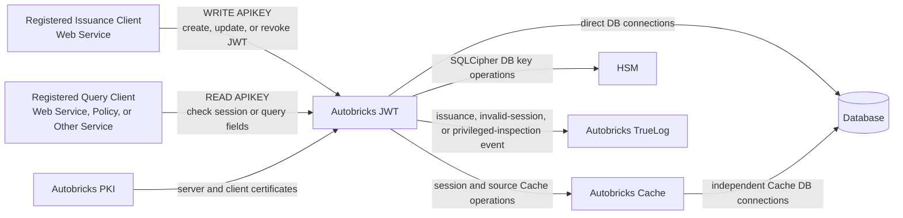
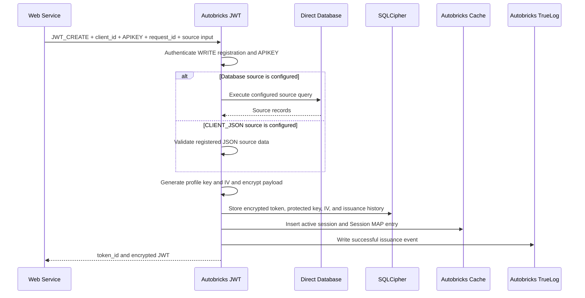
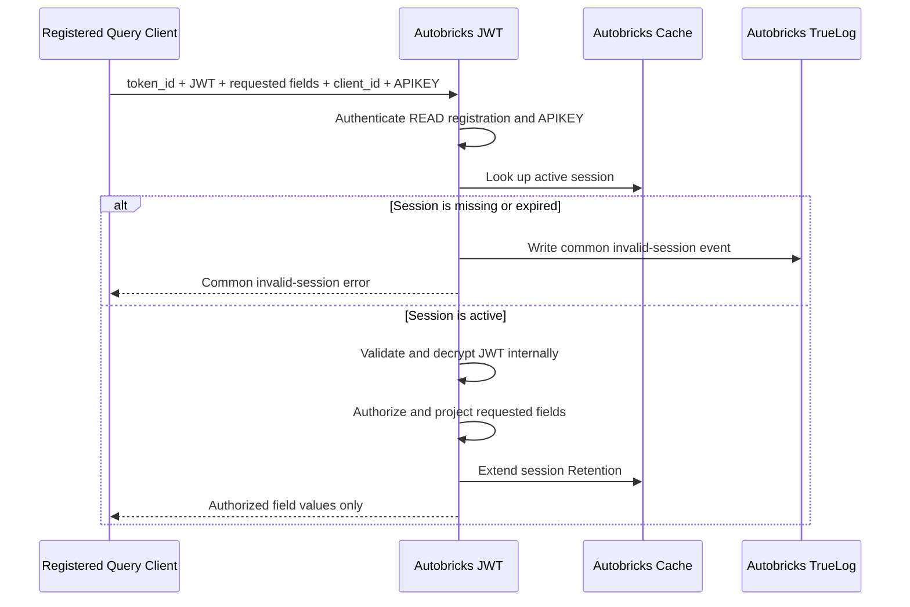

# Autobricks JWT Architecture

## Purpose

Autobricks JWT separates JWT cryptographic keys and complete payload processing from registered client services. It issues encrypted session tokens and returns only authorized fields from an active token. A Web Service can be an issuance and query client. Autobricks Policy is one optional query client and is not a required component.

## System Context



## Functional Design

### 1. Service Registration

A client service is registered before it can issue a JWT or query a JWT session. Each registration binds one `client_id`, one operation class, and one APIKEY. A service requiring WRITE and READ access creates separate registrations. Registration defines the service identity, subject type, operation-specific configuration, and field-query authorization.

Autobricks PKI issues the JWT Service server certificate and a client certificate for the registered service. The client certificate is delivered to that service during registration. Autobricks JWT stores the issued client certificate fingerprint in the SQLCipher `clients` table. When the service connects, Autobricks JWT validates the presented certificate and matches its fingerprint to the active client record. Only a registered and currently valid certificate identity can reach JWT issuance or query operations.

Connection authentication requires all of the following checks:

1. The client certificate chains to the configured trust chain.
2. The certificate is within its validity interval and is valid for client authentication.
3. The certificate contains an OCSP responder URL in its Authority Information Access extension.
4. The certificate status obtained from that AIA OCSP URL is `GOOD`.
5. The certificate SHA-256 fingerprint matches an active record in the SQLCipher `clients` table.
6. The certificate URI SAN declares the JWT operation class assigned to that client registration.

A missing or invalid AIA OCSP URL, an unavailable or unverifiable OCSP response, and any status other than `GOOD` fail closed. APIKEY authorization begins only after certificate validation succeeds.

Client certificate usage is encoded in an exact URI SAN value:

| URI SAN | Certificate usage | Allowed JWT operation class |
| --- | --- | --- |
| `urn:autobricks:jwt:read` | Read-only | Session-status and authorized-field queries |
| `urn:autobricks:jwt:write` | Write-only | JWT issuance |

The URI SAN is a signed certificate claim, but it does not authorize access by itself. The certificate fingerprint must be actively registered, the `clients` record must contain the same operation class, and the request must use the corresponding APIKEY. A certificate issued by the PKI but not registered in `clients` remains unauthorized.

Each registration produces one APIKEY with the permission of its registered
client:

| Credential | Permission | Consumer |
| --- | --- | --- |
| WRITE APIKEY | Create, modify, and revoke JWT sessions for the registered subject type | Registered WRITE client, such as a Web Service |
| READ APIKEY | Check an active session and query authorized JWT fields | Registered READ client; Autobricks Policy is one example |

One registration never combines both permissions. A WRITE APIKEY cannot query
fields, and a READ APIKEY cannot create, modify, or revoke a JWT. Every APIKEY
is bound to its own `service_id` and `client_id` registration.

Logical registration result:

```json
{
  "service_id": "example-service",
  "client_id": "<client-uuid>",
  "operation_class": "WRITE",
  "apikey": "<secret>",
  "jwt_encryption_profile": "JWE_DIR_A256GCM"
}
```

The APIKEY values are returned as credentials and never appear in TrueLog events, normal logs, error details, or token payloads. Certificate identity verification and APIKEY authorization are separate checks; passing either check does not bypass the other.

### 2. JWT Issuance by Subject

Every JWT session belongs to one subject. Autobricks JWT supports these subject types:

| Subject type | Meaning |
| --- | --- |
| `USER` | A human user identity |
| `DEVICE` | A device identity |
| `WORKLOAD` | An application, process, service, or workload identity |

The WRITE registration already identifies the service, subject type, and source. The issuance request supplies the registered client, APIKEY, request identifier, and either registered Database conditions or a validated CLIENT_JSON object.

Logical issuance input:

```json
{
  "operation": "JWT_CREATE",
  "request_id": "c2de26c8-5f40-4739-9298-1583ff40d338",
  "client_id": "53f6bd4c-fe3d-494b-ae27-4ba66fdfb87a",
  "apikey": "<write-apikey>",
  "conditions": [
    {"field": "user_id", "value": "user-1234"}
  ]
}
```

Issuance processing:

1. Authenticates the registered WRITE service with its APIKEY.
2. Verifies that the service can issue a JWT for the requested subject type.
3. Resolves the configured source data.
4. Constructs the complete JWT payload inside Autobricks JWT.
5. Generates a new content-encryption key that is used only for this token and encrypts the complete payload.
6. Stores the encrypted token, recoverable token-specific key, IV, and issuance/session history in SQLCipher.
7. Inserts the active session into Autobricks Cache and its internal Session MAP.
8. Writes the successful issuance event to syslog and, when configured, Autobricks TrueLog.
9. Returns the encrypted JWT and its one-to-one UUID `token_id`.

The caller knows data that it supplies itself but cannot obtain additional source fields or the complete constructed payload.

### 3. JWT Internal Structure

The externally visible token is a JWE compact value:

```text
BASE64URL(protected-header)..BASE64URL(iv).BASE64URL(ciphertext).BASE64URL(tag)
```

The empty second component is the JWE Encrypted Key position required by `alg: dir`. The protected header contains only the information required to process the encrypted token. The WRITE service registration selects one supported direct-key AES-GCM profile: `JWE_DIR_A128GCM`, `JWE_DIR_A192GCM`, or `JWE_DIR_A256GCM`.

Logical protected header for `JWE_DIR_A256GCM`:

```json
{
  "alg": "dir",
  "enc": "A256GCM",
  "typ": "autobricks+jwt",
  "kid": "<token-key-uuid>"
}
```

The ciphertext contains an encrypted logical payload:

```json
{
  "iss": "autobricks-jwt",
  "sub": "user-1234",
  "subject_type": "USER",
  "aud": "example-service",
  "iat": 0,
  "nbf": 0,
  "exp": 0,
  "jti": "<session-identifier>",
  "claims": {
    "<field>": "<value>"
  }
}
```

The payload shown above is a logical internal structure, not a plaintext service response. Only Autobricks JWT decrypts it as a complete object. Registered client services cannot obtain this object.

### 4. JWT Expiration Status Query

The expiration-status operation accepts `token_id`, the complete encrypted JWT, and the APIKEY from a READ registration. It does not return payload fields.

Processing:

1. Authenticates the registered READ service with its APIKEY.
2. Looks up the active session in Autobricks Cache.
3. Validates token integrity, audience, absolute `exp`, and session state inside Autobricks JWT.
4. Returns an active status only when the token and Cache session are both active.
5. Returns the common invalid-session error when the session is expired or does not exist.

Logical active response:

```json
{
  "status": "ACTIVE"
}
```

Logical invalid response:

```json
{
  "status": "ERROR",
  "error": "SESSION_NOT_FOUND_OR_EXPIRED"
}
```

The invalid response never distinguishes an expired session from a session that never existed.

### 5. JWT Field Query

The field-query operation accepts `token_id`, the complete encrypted JWT, the APIKEY from a READ registration, and an explicit field list.

Logical request:

```json
{
  "token_id": "73475423-3470-4da3-b702-0d234b3632cd",
  "token": "<base64url-jwe-compact-token>",
  "fields": ["department", "role"]
}
```

Processing:

1. Authenticates the registered READ service with its APIKEY.
2. Confirms that the session is active.
3. Validates and decrypts the complete JWT only inside Autobricks JWT.
4. Authorizes each requested field for the registered service.
5. Projects only the authorized requested values.
6. Extends the Cache idle Retention for the active session.
7. Returns the field projection without returning the complete payload.

Logical response:

```json
{
  "fields": {
    "department": "engineering",
    "role": "reviewer"
  }
}
```

The interface provides no wildcard, root-object, or complete-payload query.

### 6. JWT Expiration

JWT session validity has two independent limits:

| Limit | Behavior |
| --- | --- |
| Absolute expiration | The encrypted payload's `exp` value defines the maximum token lifetime and is not changed by a field query. |
| Idle expiration | Autobricks Cache Retention removes a session that has no authorized activity within the configured interval. An authorized active-session query extends this interval. |

A session is active only while both limits remain valid. When either limit expires:

- The session is rejected with `SESSION_NOT_FOUND_OR_EXPIRED`.
- The database record does not reactivate the expired Cache session.
- The JWT is not reissued automatically.
- Autobricks JWT writes the common invalid-session event when the expired token is requested.

### 7. JWT Service Log Examples

Autobricks JWT creates TrueLog audit evidence for successful JWT issuance,
expired or nonexistent session requests, and privileged local complete-token
inspection. The examples below show issuance and invalid-session events.

The normative event, prohibited-content, receipt-validation, and local receipt-state rules are defined in [LOGGING.md](LOGGING.md).

Successful issuance:

```json
{
  "event": "JWT_ISSUED",
  "service_id": "example-service",
  "subject_type": "USER",
  "result": "SUCCESS",
  "event_at": "2026-01-01T00:00:00Z"
}
```

Expired or nonexistent session request:

```json
{
  "event": "JWT_SESSION_INVALID",
  "service_id": "example-service",
  "result": "ERROR",
  "error_code": 8060,
  "error": "SESSION_NOT_FOUND_OR_EXPIRED",
  "event_at": "2026-01-01T00:00:00Z"
}
```

Audit events do not contain an APIKEY, JWT, `jti`, complete payload, decrypted field value, database credential, HSM credential, or cryptographic key. The invalid-session event always carries error code `8060`. Successful expiration-status queries, successful field queries, client-side decisions, Retention extension, and Cache activity do not create JWT TrueLog events.

After TrueLog durably appends an event, it returns an append receipt containing `hostname`, `service`, and the before/after file name, file size, and checksum. Autobricks JWT stores that complete receipt in the corresponding local database record for the issuance, invalid-session, or privileged-inspection event. The receipt is database evidence and is not added to the TrueLog event payload.

Logical receipt record:

```json
{
  "event": "JWT_ISSUED",
  "hostname": "autobricks-jwt",
  "service": "autobricks-jwt",
  "before": {
    "file": "truelog-YYYY-MM-DD.log",
    "filesize": 0,
    "checksum": "<sha256>"
  },
  "after": {
    "file": "truelog-YYYY-MM-DD.log",
    "filesize": 0,
    "checksum": "<sha256>"
  }
}
```

The stored receipt provides the WORM file location and checksum-chain boundary needed for later audit verification. A TrueLog append is not reported as complete until a valid receipt is received. If the append succeeds but local receipt persistence fails, the event enters a reconciliation state rather than being written to TrueLog a second time without proof that duplication is safe.

## Responsibility Boundaries

| Component | Responsibility | Excluded responsibility |
| --- | --- | --- |
| Autobricks JWT | Service registration, SQLCipher client records, certificate-chain and validity verification, AIA-based OCSP validation, registered fingerprint and URI SAN usage verification, APIKEY authorization, token construction, encryption, validation, internal decryption, field authorization, session handling, defined TrueLog events, and receipt persistence | Correctness of compromised external source records |
| Registered Web Service | Authentication of its end user, association of the opaque JWT or `token_id` with its own application session, and authorization of each application-level query or revocation request | JWT keys, direct token decryption, complete payload access, and delegation of end-user authentication to Autobricks JWT |
| Registered issuance client | JWT issuance requests and token transport; a Web Service is one example | JWT keys and complete decrypted payload access |
| Registered query client | Active-session checks and authorized field queries; Autobricks Policy is one example | JWT keys, direct token decryption, complete payload access, and end-user authentication decisions |
| Autobricks PKI | Server and client certificate issuance and trust material for TLS and mutual TLS identity | JWT issuance, payload processing, service authorization, and session state |
| Autobricks Cache | MAP-based lookup, mutation, persistence queue, and Retention according to Cache Definitions | JWT cryptography and field authorization |
| Database owner | Source-record integrity, access control, change authorization, backup security, and compromise detection | JWT cryptographic processing |
| Autobricks TrueLog | Durable evidence for issuance, invalid-session requests, and privileged local token inspection | Token payload storage and client-side decisions |
| HSM | Protection and use of the SQLCipher database key | Protection from every operation performed by an authorized compromised host |

## Internal Components

```text
Service Interface
├── Unix Domain Socket
├── TCP
├── TLS
└── Mutual TLS
        │
        ▼
Request Authentication
├── Service Registry
├── Certificate chain, validity, and purpose verification
├── AIA OCSP status verification
├── SQLCipher client fingerprint verification
├── Certificate URI SAN operation verification
├── WRITE APIKEY authorization
└── READ APIKEY authorization
        │
        ├──► Issuance Service
        │     ├── Source Resolver
        │     ├── Payload Builder
        │     ├── Token Cryptography
        │     ├── Session Store
        │     └── TrueLog Writer
        │
        └──► Field Query Service
              ├── Session Lookup
              ├── Token Validation
              ├── Field Authorization
              ├── Internal Payload Decryption
              ├── Field Projection
              └── Retention Extension

Shared Infrastructure
├── Direct Database Layer
├── Autobricks Cache Adapter
├── SQLCipher Key Store
├── HSM Adapter
├── PKI/TLS Configuration
└── Error Mapper
```

### Service Interface

The service supports Unix domain socket, TCP, TLS, and mutual TLS transports according to the active dependency profile. Secure network access uses Autobricks PKI-issued identity certificates. The JWT Service presents its server certificate and validates the connecting service's client certificate chain, validity, client-authentication purpose, AIA OCSP `GOOD` status, and registered fingerprint before allowing JWT issuance or query operations. Transport selection does not change APIKEY, token, field authorization, session, database, Cache, or logging semantics.

### Management Interface

JWT client registration, modification, and deletion use a local management path
that is separate from every JWT service transport. An interactive `ab-jwt-cli`
process connects to the restricted Unix domain socket owned by
`autobricks-jwt-cli.service`. The client service verifies the caller's Unix peer
identity, authorizes and filters the requested management operation, and then
forwards the accepted request to `ab-jwtd` through a separate restricted server
management Unix domain socket.

Interactive users cannot connect directly to the server management socket, and
neither management socket is world-accessible. Filesystem ownership, restrictive
socket permissions, and peer-credential verification are all required. The
TCP, TLS, and mutual TLS JWT service interfaces never expose management
operations.

When certificate provisioning succeeds, the service path returns the verified
certificate package to the interactive `ab-jwt-cli` process. That process writes
the package into its invocation working directory with the caller's ownership.
The broker and server do not write to a caller-supplied arbitrary filesystem
path.

TLS and mutual TLS are enabled only when the Autobricks PKI client is installed, configured, and the required certificate material validates successfully. Without that dependency, the service exposes only Unix domain socket and TCP. The dependency and secure installation profiles are defined in [DEPENDENCIES.md](DEPENDENCIES.md).

TLS and mutual TLS transports support persistent keep-alive connections. A client can send multiple framed requests over one authenticated connection, reusing the established TLS channel instead of performing a new handshake for every JWT operation. Each request carries its own operation credentials and correlation identifier; keep-alive does not reuse or broaden an APIKEY authorization decision.

The authenticated certificate identity is bound to the connection. Its absolute connection deadline is the earlier of the configured maximum connection lifetime and the client certificate's `notAfter` time. The service closes the connection no later than that deadline and never accepts a request over a connection after the certificate expires. It also closes the connection on framing errors, protocol violations, idle timeout, failed certificate-status refresh, inactive client registration, or transport failure. Certificate and OCSP validation must be refreshed according to the configured security interval; a persistent connection cannot remain authorized after required revalidation fails.

Keep-alive uses a sliding idle timeout measured in seconds. The service configuration supplies the default value:

```yaml
timeout: 3600
```

`3600` is an example configuration value, not a protocol constant. Each registered client can have its own keep-alive timeout in the SQLCipher `clients` record. A client-specific value overrides the configuration default; otherwise, the configured `timeout` applies. After each successfully authenticated and processed request, the connection's idle deadline is renewed to `now + effective_timeout`, capped by the absolute connection deadline. Unauthenticated bytes, malformed frames, and rejected requests do not renew it. When the idle deadline is reached, the server closes the connection so the client reconnects and authenticates again.

### Service Registry

Every client service is registered before using JWT operations. Registration records the Autobricks PKI-issued client certificate fingerprint and its URI SAN operation class in the SQLCipher `clients` table and delivers the client certificate to the registered service. The client record must remain active for the certificate to authenticate. Each registration produces one APIKEY:

| Credential | Allowed operation | Consumer |
| --- | --- | --- |
| WRITE APIKEY | Create, modify, and revoke an encrypted JWT session | Registered WRITE client, such as a Web Service |
| READ APIKEY | Check an active session and query authorized fields | Registered READ client; Autobricks Policy is one example |

An APIKEY is bound to its registered service, `client_id`, and operation class. A service requiring both operation classes uses separate registrations and credentials. Authorization is the intersection of the certificate URI SAN operation, the active `clients` registration operation, and the APIKEY operation. A mismatch is rejected.

### Source Resolver

The Source Resolver supplies token input from one of the configured sources:

- Client-supplied JSON
- A direct database query

A caller necessarily knows values that it supplies itself. It does not gain access to additional database-derived fields or to the complete payload constructed inside Autobricks JWT.

### Token Cryptography

Token encryption and complete payload decryption occur only inside Autobricks JWT. Registered client services receive neither JWT cryptographic keys nor a complete decrypted payload.

A privileged local administrator can inspect a complete generated payload only
through `sudo ab-jwt-cli` and the restricted management Unix-socket path. The
operation requires matching `request_id` and `token_id`, root Unix peer
credentials, and successful SQLCipher token/key validation. It is not exposed
through Unix client service access for ordinary users, TCP, TLS, or mTLS. The
plaintext is returned only to the invoking administrator terminal and is never
written to syslog or TrueLog. Successful inspection requires separate TrueLog
audit evidence without plaintext or key material. The returned append receipt
is stored with the corresponding SQLCipher inspection record.

The cryptographic component returns an encrypted token during issuance. During field query, it decrypts the complete payload only within the JWT Service process and passes only the authorized field projection to the response layer.

### Field Authorization

Field authorization evaluates the registered READ service, APIKEY, token context, and requested field names. The response contains only authorized requested fields. The interface does not provide a complete-payload operation.

### Direct Database Layer

Autobricks JWT directly supports PostgreSQL, MariaDB, MySQL, SQLite, and SQLCipher. Direct JWT database connections are independent of Autobricks Cache Connections and database adapters.

Direct database access handles configured JWT service data, registration data, token source data, and session records.

SQLCipher is the durable request-history, issuance-history, and token-key store. A JWT creation request must supply `client_id`, APIKEY, client-generated `request_id`, and the registered source's token-generation conditions. For a Database source, `conditions` is an array of `{field, value}` objects whose field names must exactly match the registered SELECT input fields; the registered field order determines SQL binding order. A separate `requests` row records `request_id`, `client_id`, the resolved `service_id`, `received_at`, processing status, completion time, assigned error code, and successful `jti` relationship. APIKEYs and raw subject conditions are not persisted in request history. The pair of `client_id` and `request_id` is unique and cannot silently create multiple tokens.

The SQLCipher `operations` table contains the fixed runtime definitions `JWT_CREATE`, `JWT_UPDATE`, `JWT_REVOKE`, and `JWT_QUERY` with their required WRITE or READ operation class. Runtime requests resolve `operation` through this table before request-specific processing. Service registration cannot add or change operation definitions. The normative registry and examples are defined in [Operation Definitions](docs/10-operation-definitions.md).

`JWT_UPDATE` is an upsert of the encrypted JWT's dynamic `claims` JSON object, not a requirement to update a Database row. It can replace an existing claim or add an application field that was absent from the original Database result and does not exist as a Database column. Reserved JWT metadata remains immutable, and JSON structure and payload limits are validated at runtime. Successful update preserves `token_id` and `jti`, generates a new token-specific encryption key and replacement encrypted token, invalidates the previous token version, records the version in SQLCipher, and atomically replaces the active Cache digest and key reference.

Every issued token has a persistent record containing at least `client_id`, `service_id`, `request_id`, the UUID `token_id`, the encrypted `token`, its recoverable token-specific `token_key`, the 96-bit `iv` used for that token version, and `issued_at`. `iv` is stored as 12 binary bytes and must match the decoded JWE Initialization Vector component during validation. `token_id` is returned with the token, maps one-to-one to it, and is stored as the same UUID as the JWT `jti`. The same record also contains `kid`, expiration, session state, token digest, and audit-receipt state required for later validation and operation. The plaintext payload is not stored as issuance history. Each token uses an independently generated content-encryption key; a content-encryption key is never reused for another token. The key remains recoverable only inside `ab-jwtd` after SQLCipher is opened through the HSM-managed Database-key path so the token can later be authenticated and decrypted.

The installation setting `require_token_for_query_and_revoke` controls whether
`JWT_QUERY` and `JWT_REVOKE` must carry the complete encrypted token in addition
to `token_id`. The secure default is `true`. When set to `false`, `ab-jwtd`
loads the stored token selected by `token_id` and performs the same internal
cryptographic, service-binding, session, and authorization validation. Any
submitted token must match the stored token. Runtime requests cannot override
this server setting.

The SQLCipher `clients` table is the authoritative certificate registration store. It associates a registered service with its client certificate SHA-256 fingerprint, URI SAN operation class, and active registration state. A valid certificate that has no active matching record is not authorized to use JWT operations.

The client record can also define that client's keep-alive timeout in seconds. Absence of the client-specific value selects the service configuration's `timeout` default.

### Cache Adapter

Autobricks JWT uses the public Autobricks Cache interface without JWT-specific changes to the Cache implementation.

Session Cache behavior follows these rules:

- JWT issuance inserts the active session into the Cache.
- Authorized field lookup of an active session extends Retention.
- A missing session Cache record is an invalid session.
- A missing or expired session is not restored from the session database record.
- Database persistence does not make an expired Cache session active again.

Separate Caches can serve user, account, device, or other source records. Their SELECT, MAP, mutation, and Retention configuration is independent of the session Cache.

### TrueLog Writer

Autobricks JWT creates audit evidence for:

1. Successful JWT issuance
2. Expired or nonexistent session request
3. Privileged local complete-token inspection

An expired session and a nonexistent session use the same service error and TrueLog event category. Normal field queries, client-side decisions, Retention extension, and Cache activity do not create JWT TrueLog events.

TrueLog records exclude APIKEYs, JWT values, complete payloads, decrypted field values, and cryptographic secrets.

After a successful append, the TrueLog Writer validates the returned hostname, service, before/after file names, byte sizes, and checksums and updates the corresponding JWT issuance, invalid-session, or privileged-inspection database record with those receipt fields. These fields are local database evidence for later WORM metadata and checksum-chain verification; they are not written into the TrueLog event and do not create an additional TrueLog event category.

## Operational and Audit Log Separation

Autobricks JWT stores operational service logs and audit-evidence logs separately. They have different purposes, destinations, and retention responsibilities.

| Log class | Destination | Purpose | Content | TrueLog receipt |
| --- | --- | --- | --- | --- |
| Operational service log | Operating server syslog | Diagnose failures and provide local operational visibility for audit events | Assigned `error_code`, `error_name`, timestamp, redacted diagnostic context, and a copy of each defined audit event | No |
| Audit-evidence log | Autobricks TrueLog | Preserve evidence of issuance, invalid-session requests, and privileged complete-token inspection | Structured, redacted security events | Yes; stored in the corresponding JWT database record |

Every audit event is written to syslog as well as submitted to TrueLog. The syslog copy provides local operational visibility but is not audit evidence. TrueLog remains the authoritative audit-evidence destination.

TrueLog submission and receipt persistence are enabled only when the Autobricks TrueLog client is installed and configured. Without it, audit events remain in syslog only and no TrueLog evidence or receipt exists. A runtime delivery failure after TrueLog has been enabled follows the audit failure and reconciliation rules; it is not treated as an intentional syslog-only profile change.

Other operational syslog entries are not submitted to TrueLog merely because they contain an error code. Syslog entries do not create TrueLog append receipts or audit-receipt database records, and the TrueLog receipt is not added to the syslog copy.

Audit events are not used as a replacement for service diagnostics. A TrueLog delivery or receipt-persistence failure is classified and written to syslog, while a successfully returned TrueLog receipt is stored only with the corresponding local audit record.

The two log paths must use separate writers and failure handling. A failure in one path must not silently redirect its record into the other path.

### Key Store

JWT key data is stored in a SQLCipher-encrypted database. The SQLCipher database key is managed through an HSM. Each token receives a new random content-encryption key, and that recoverable secret key is persisted only inside SQLCipher with its issuance record. The JWE `kid` selects the candidate key record; successful authenticated decryption and matching `jti`, service, digest, expiration, and active Cache session establish validity. JWT cryptographic keys and the SQLCipher database key are not returned through service interfaces.

This boundary minimizes key exposure but does not treat root access to the JWT Service host as safe. A privileged host attacker may inspect runtime plaintext, obtain material available to the process, or invoke cryptographic operations available to the service.

## Issuance Flow



The issuance response never contains the complete plaintext payload or JWT cryptographic keys.

## Field Query Flow



## Data Trust Boundary

Autobricks JWT treats records returned by a correctly configured source query as input data. It cannot determine whether a valid-looking source record was maliciously inserted, altered, or substituted before query execution.

A compromised user table can therefore produce a cryptographically valid token containing false data. Responsibility for that source compromise remains with the database owner. Autobricks JWT remains responsible for correct APIKEY enforcement, configured query execution, token construction, encryption, field authorization, and session handling.

## Error Disclosure Boundary

The external error model does not distinguish an expired session from a session that never existed. This prevents callers from using the response or TrueLog category to determine prior session existence.

Errors and logs do not expose payloads, decrypted field values, APIKEYs, database credentials, HSM credentials, or cryptographic keys.

Every classified service failure writes its assigned `error_code` and `error_name` to the operating server's syslog, including connection-closing and internal failures. Syslog is for service failure diagnosis and is not audit evidence. It does not create a TrueLog receipt or an additional TrueLog category. Only `JWT_SESSION_INVALID` is an error audit event in TrueLog, and it carries code `8060`.

The authoritative `8000` through `8100` error registry, response envelope, exposure classes, and security mappings are defined in [ERROR.md](ERROR.md).

## Fixed Architecture Decisions

- Public repository artifacts are written in English.
- Complete payload access is internal to Autobricks JWT.
- Service registration is required before JWT operations.
- Autobricks PKI issues the JWT Service server certificate and registered-service client certificates.
- Service registration stores the client certificate fingerprint in the SQLCipher `clients` table.
- Network access requires a valid certificate chain, validity interval, client-authentication purpose, `GOOD` status from the AIA OCSP URL, and an active matching client fingerprint before JWT issuance or query authorization.
- Client certificate URI SAN `urn:autobricks:jwt:read` authorizes only query operations, and `urn:autobricks:jwt:write` authorizes only creation, modification, and revocation operations.
- Effective permission is the intersection of the certificate URI SAN, active `clients` registration, and request APIKEY operation class.
- TLS and mutual TLS connections support multiple framed requests so the established secure session can be reused.
- Keep-alive uses the registered client's timeout or the configuration `timeout` default, renews its idle deadline after each valid processed request, and closes the idle connection to require reconnection.
- Idle renewal cannot extend the connection beyond the configured maximum lifetime or the certificate's `notAfter` time. Keep-alive also remains subject to OCSP refresh and active client registration.
- WRITE and READ use separate service registrations and APIKEY permissions.
- Registered client services cannot obtain the complete decrypted payload.
- Direct database support is independent of Autobricks Cache.
- Autobricks Cache is consumed through its existing public behavior.
- JWT issuance, common invalid-session failure, and privileged local complete-token inspection create JWT TrueLog audit evidence.
- SQLCipher protects JWT key data at rest, and an HSM manages the SQLCipher database key.
- Root compromise of the JWT Service host remains outside the protected trust boundary.
