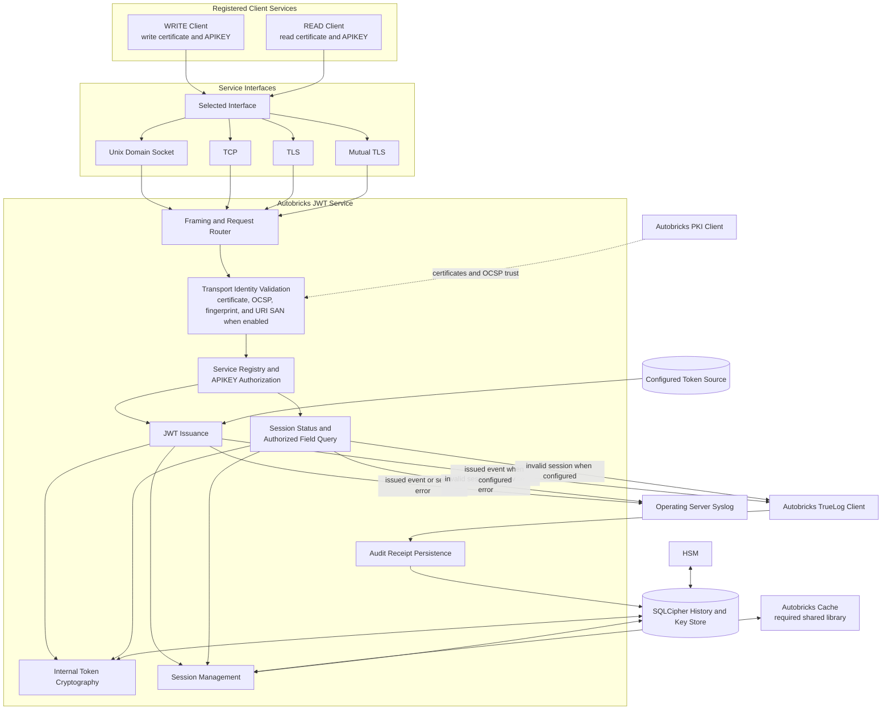
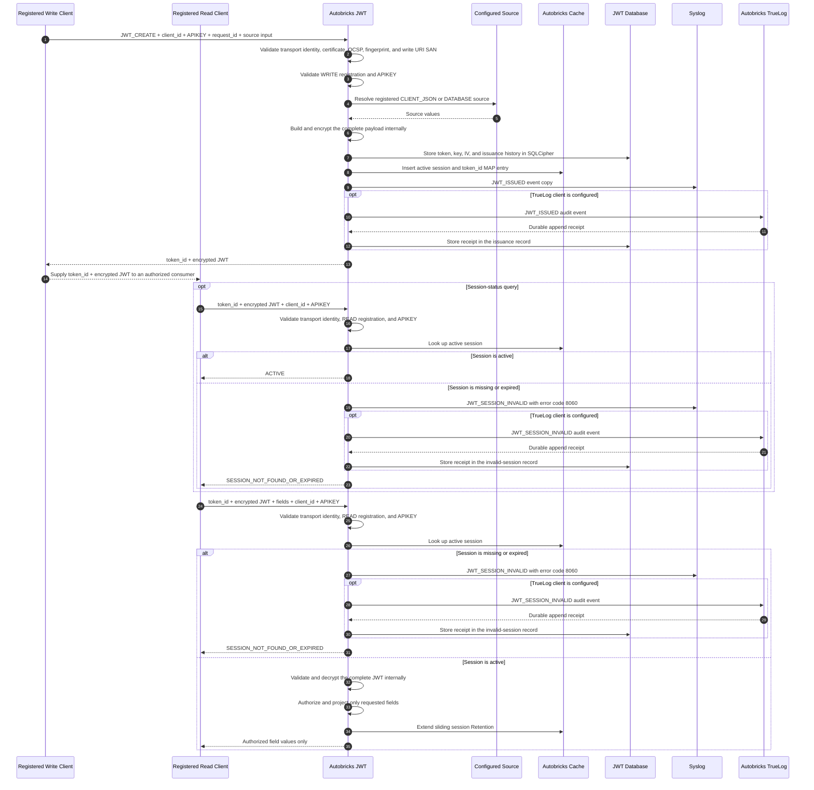

# Autobricks JWT

Autobricks JWT issues encrypted session tokens and provides authorized access to individual token fields without exposing the complete token payload.

## Service Block Diagram

Autobricks Cache is required. PKI and TrueLog integrations are conditional as defined in [DEPENDENCIES.md](DEPENDENCIES.md). Without the PKI client, only Unix domain socket and TCP are available. Without the TrueLog client, audit-event copies remain in syslog and no immutable audit receipt is stored.

## Service Registration

A service must be registered before it can use Autobricks JWT. Each service
registration binds one `client_id`, one operation class, and one APIKEY.
Services requiring both operation classes create separate WRITE and READ
registrations.

| Registration | APIKEY permission | Consumers |
| --- | --- | --- |
| WRITE | Create, modify, and revoke encrypted JWT sessions | Web Service |
| READ | Check active sessions and query authorized fields | Web Service, Autobricks Policy |

An APIKEY is valid only for its assigned operation and registered service.

## Issuance-to-Query Sequence

The sequence shows the Secure dependency profile. Read and write operations use separately issued client certificates. Reduced profiles apply the transport limitations in [DEPENDENCIES.md](DEPENDENCIES.md). Complete plaintext payloads and JWT cryptographic keys remain inside Autobricks JWT throughout both flows.

## Token Issuance

- Accepts token source data through the registered CLIENT_JSON or DATABASE source.
- Creates the token payload inside Autobricks JWT.
- Encrypts the payload before returning the JWT.
- Prevents the requesting service from reading the complete token payload.
- Authenticates issuance requests with the APIKEY from the WRITE registration.
- Persists JWT session records in the configured database.
- Writes a successful issuance event to syslog and, when the Autobricks TrueLog client is configured, to Autobricks TrueLog.

## Field Query

- Authenticates field-query requests with the APIKEY from the READ registration.
- Validates the registered service, token integrity, intended audience, expiration, and session state.
- Decrypts the token only inside Autobricks JWT.
- Authorizes every requested field for the calling service.
- Returns only the authorized field values requested by the caller.
- Never returns the complete decrypted payload to a Web Service or Autobricks Policy.
- Extends session retention when an authorized query accesses an active session.

## Session Errors

- Returns the same error for an expired session and a nonexistent session.
- Does not reveal whether an invalid session previously existed.
- Writes the common expired-or-nonexistent session error to syslog and, when the Autobricks TrueLog client is configured, to Autobricks TrueLog.

## Cache and Database

- Uses [Autobricks Cache](https://github.com/pregene/autobricks-cache) for MAP-based in-memory session lookup and configurable retention.
- Uses the Connection-owned WRITE Queue for Cache Definitions configured with asynchronous persistence.
- Commits JWT request history, issuance history, token keys, IVs, and audit receipts to SQLCipher independently of Cache persistence.
- Provides configurable Cache Definitions for each deployment.
- Supports independent Caches for optional source data such as users, accounts, and devices.
- Keeps source-data Cache loading and retention separate from JWT session retention.

## Service Interfaces

The same registration, authentication, token, authorization, session, and Cache functions are available through:

- Unix domain socket
- TCP
- TLS
- Mutual TLS

TLS and mutual TLS require an installed and configured Autobricks PKI client. Without it, Autobricks JWT provides only the Unix domain socket and TCP interfaces. See [DEPENDENCIES.md](DEPENDENCIES.md).

## Related Service Responsibilities

| Service | Responsibility |
| --- | --- |
| Autobricks JWT | Service registration, APIKEY authorization, encrypted JWT issuance, token validation, payload decryption, field authorization, and session handling |
| [Autobricks PKI](https://github.com/pregene/autobricks-pki) | Certificates and trust material for TLS and mutual TLS service connections |
| Autobricks Policy | JWT field queries and policy evaluation without access to the complete decrypted payload |
| [Autobricks Cache](https://github.com/pregene/autobricks-cache) | In-memory lookup, mutation, database persistence, and retention |
| [Autobricks TrueLog](https://github.com/pregene/autobricks-log) | Durable evidence for JWT issuance, invalid-session requests, and privileged local token inspection |

## True Log Events

When the Autobricks TrueLog client is installed and configured, Autobricks JWT writes audit evidence for:

1. Successful JWT issuance
2. Expired or nonexistent session request
3. Privileged local complete-token inspection

Successful field queries, policy evaluation, session retention extension, and Cache activity do not create JWT TrueLog events.

Without the Autobricks TrueLog client, these events are written only to syslog and no immutable audit evidence or append receipt is produced. For secure deployment requirements and installation order, see [DEPENDENCIES.md](DEPENDENCIES.md).

## Security Boundaries

- Token payload encryption and decryption occur only inside Autobricks JWT.
- Complete payload decryption is unavailable to service clients; only the
  privileged local root inspection path can display it.
- Web Services and Autobricks Policy cannot obtain a complete decrypted payload.
- Web Services and Autobricks Policy do not receive decryption keys.
- WRITE and READ APIKEYs have separate permissions.
- Audit records do not contain APIKEYs, JWTs, complete payloads, decrypted field values, or cryptographic secrets.
- Logs and error details do not expose protected token content.

## Key Management

- Autobricks JWT manages JWT encryption and decryption keys inside the service boundary.
- Service interfaces never return JWT encryption keys, JWT decryption keys, or key-storage credentials.
- JWT key data is stored in a SQLCipher-encrypted database.
- The SQLCipher database key is managed through an HSM.
- Internal key management, encrypted storage, and HSM protection minimize key exposure but do not claim protection from a privileged host administrator.
- A user with root access to the JWT Service host can inspect the running system and may obtain key material available to the service.

## Process Documentation

Process-level design documents are indexed in [docs/README.md](docs/README.md). Each registration, token, and deletion lifecycle process is maintained as a separate document.

Runtime request names, required READ or WRITE permission classes, and common
request examples are defined in
[Operation Definitions](docs/10-operation-definitions.md).

## JWT Standards

JWT, JWS, JWE, JWK, JWA, and JWT security references are listed in
[REFERENCES.md](REFERENCES.md).

## License

Autobricks JWT is governed by the terms in [LICENSE](LICENSE).
