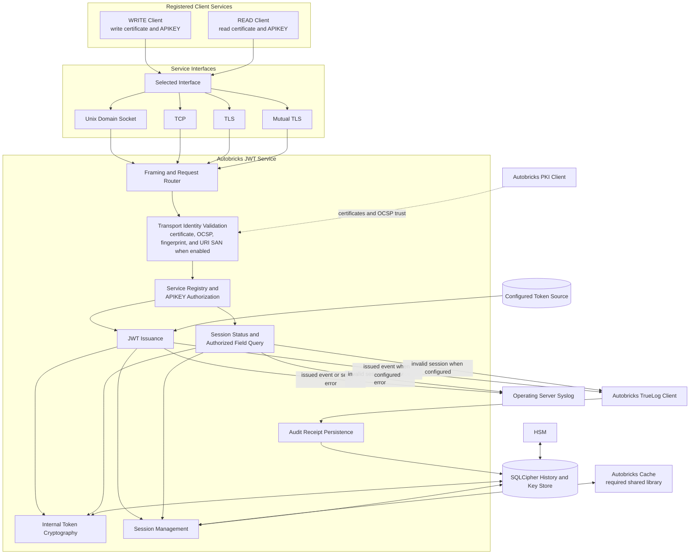
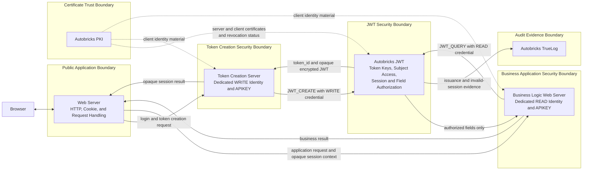

# Autobricks JWT

Autobricks JWT issues encrypted session tokens and provides authorized access to individual token fields without exposing the complete token payload.

## Service Block Diagram

Autobricks Cache is required. PKI and TrueLog integrations are conditional as
defined in [DEPENDENCIES.md](DEPENDENCIES.md). Without the PKI client, only Unix
domain socket and TCP are available. With audit logging enabled but without the
TrueLog client, audit-event copies remain in syslog and no immutable audit
receipt is stored.

## Service Registration

A service must be registered before it can use Autobricks JWT. Each service
registration binds one `client_id`, one operation class, and one APIKEY.
Services requiring both operation classes create separate WRITE and READ
registrations.

| Registration | APIKEY permission | Consumers |
| --- | --- | --- |
| WRITE | Create, modify, and revoke encrypted JWT sessions | Web Service |
| READ | Check active sessions and query authorized fields | Web Service, Autobricks Policy |

An APIKEY is valid only for its assigned operation and registered service.

## Issuance-to-Query Sequence

The sequence shows the Secure dependency profile. Read and write operations use separately issued client certificates. Reduced profiles apply the transport limitations in [DEPENDENCIES.md](DEPENDENCIES.md). Complete plaintext payloads and JWT cryptographic keys remain inside Autobricks JWT throughout both flows.

The sequence also shows the secure default
`require_token_for_query_and_revoke: true`. An installation may set it to
`false` so query and revocation requests send `token_id` without retransmitting
the complete JWE. In that mode, `ab-jwtd` loads and validates the stored token;
all connection, client, APIKEY, service, session, and field permissions remain
required. See [INSTALL.md](INSTALL.md).

## Token Issuance

- Accepts token source data through the registered CLIENT_JSON or DATABASE source.
- Creates the token payload inside Autobricks JWT.
- Encrypts the payload before returning the JWT.
- Prevents the requesting service from reading the complete token payload.
- Authenticates issuance requests with the APIKEY from the WRITE registration.
- Persists JWT session records in the configured database.
- When audit logging is enabled, writes a successful issuance event to syslog
  and, when the Autobricks TrueLog client is configured, to Autobricks TrueLog.

## Field Query

- Authenticates field-query requests with the APIKEY from the READ registration.
- Validates the registered service, token integrity, intended audience, expiration, and session state.
- Decrypts the token only inside Autobricks JWT.
- Authorizes every requested field for the calling service.
- Returns only the authorized field values requested by the caller.
- Never returns the complete decrypted payload to a Web Service or Autobricks Policy.
- Extends session retention when an authorized query accesses an active session.

## Session Errors

- Returns the same error for an expired session and a nonexistent session.
- Does not reveal whether an invalid session previously existed.
- Writes the classified expired-or-nonexistent session failure to syslog and,
  when audit logging and the Autobricks TrueLog client are enabled, writes the
  common audit event to Autobricks TrueLog.

## Cache and Database

- Uses [Autobricks Cache](https://github.com/pregene/autobricks-cache) for MAP-based in-memory session lookup and configurable retention.
- Uses the Connection-owned WRITE Queue for Cache Definitions configured with asynchronous persistence.
- Commits enabled JWT request and issuance logs, token keys, IVs, and enabled
  audit receipts to SQLCipher independently of Cache persistence. Internal log
  records follow the 90-day Drain contract.
- Provides configurable Cache Definitions for each deployment.
- Supports independent Caches for optional source data such as users, accounts, and devices.
- Keeps source-data Cache loading and retention separate from JWT session retention.

## Service Interfaces

The same registration, authentication, token, authorization, session, and Cache functions are available through:

- Unix domain socket
- TCP
- TLS
- Mutual TLS

TLS and mutual TLS require an installed and configured Autobricks PKI client. Without it, Autobricks JWT provides only the Unix domain socket and TCP interfaces. See [DEPENDENCIES.md](DEPENDENCIES.md).

## Related Service Responsibilities

| Service | Responsibility |
| --- | --- |
| Autobricks JWT | Service registration, APIKEY authorization, encrypted JWT issuance, token validation, payload decryption, field authorization, and session handling |
| Web Service | End-user authentication, application-session association, and authorization to query or revoke the selected opaque JWT session |
| [Autobricks PKI](https://github.com/pregene/autobricks-pki) | Certificates and trust material for TLS and mutual TLS service connections |
| Autobricks Policy | JWT field queries and policy evaluation without access to the complete decrypted payload |
| [Autobricks Cache](https://github.com/pregene/autobricks-cache) | In-memory lookup, mutation, database persistence, and retention |
| [Autobricks TrueLog](https://github.com/pregene/autobricks-log) | Durable evidence for JWT issuance, invalid-session requests, and privileged local token inspection |

## True Log Events

When audit logging is enabled and the Autobricks TrueLog client is installed
and configured, Autobricks JWT writes audit evidence for:

1. Successful JWT issuance
2. Expired or nonexistent session request
3. Privileged local complete-token inspection

Successful field queries, policy evaluation, session retention extension, and Cache activity do not create JWT TrueLog events.

With audit logging enabled but without the Autobricks TrueLog client, these
events are written only to syslog and no immutable audit evidence or append
receipt is produced. With audit logging disabled, no audit event or receipt is
created. For secure deployment requirements and installation order, see
[DEPENDENCIES.md](DEPENDENCIES.md).

## Recommended Dedicated Deployment

Autobricks JWT should run as a dedicated service in a security domain separate
from SSO servers, OAuth or OpenID Connect Authorization Servers, and ordinary
Web Servers. Those systems use registered WRITE or READ operations instead of
holding JWT cryptographic keys or directly processing the complete decrypted
payload.

For a Database-backed subject source, the recommended integration also keeps
the login subject Database credential, SELECT logic, Cache, and permitted
subject mutation path inside the Autobricks JWT service boundary. SSO, OAuth,
and Web Server components request JWT creation, authorized-field lookup, or
revocation through their narrowly scoped client registrations. They do not
need direct login-subject queries or updates for those JWT session operations.

This separation reduces the impact of a compromised application server:

- The compromised server does not obtain the JWT encryption keys or complete
  decrypted payload.
- It does not automatically obtain the login subject Database credential or a
  general-purpose subject query or mutation interface.
- A stolen READ APIKEY remains limited to its registered fields, and a stolen
  WRITE APIKEY remains limited to its registered service and WRITE operations.
- Separately deployed SSO, OAuth, and application components can use different
  credentials and minimum field allowlists so compromise of one component does
  not automatically expose every login permission.

Dedicated deployment raises the security level by adding independent trust
boundaries and requiring additional compromise steps. Compromise of one Web
Server provides only the credentials and permissions present in that server.
Reaching JWT keys, complete payloads, or the subject Database additionally
requires crossing the registered client boundary, transport and source CIDR
controls, the Autobricks JWT service boundary, SQLCipher protection, and the
HSM-managed Database-key path as applicable.

Host separation, mTLS, source CIDR restrictions, least-privilege
registrations, protected secret storage, monitoring, and compromise recovery
increase the number and difficulty of the steps required to reach protected
JWT and subject assets.

### Recommended Server Separation

This layout gives each server only the credential required for its purpose:

- The public Web Server handles browser traffic and opaque session transport
  without receiving JWT keys or direct subject Database access.
- The Token Creation Server holds a dedicated WRITE identity and APIKEY. It can
  request creation, modification, or revocation but cannot query token fields.
- The Business Logic Web Server holds a dedicated READ identity and APIKEY with
  only the fields needed for its business function. It cannot create, modify,
  or revoke a session.
- Autobricks JWT owns token cryptography, subject access, session state, and
  field authorization in a separate security boundary.
- Autobricks TrueLog receives the defined immutable audit evidence without
  receiving JWT values, keys, or decrypted fields.
- Autobricks PKI provides the certificate identities and revocation status used
  for protected service connections.

This separation raises the security level because compromise of the public Web
Server, Token Creation Server, or Business Logic Web Server exposes a different
and limited permission set. Reaching another permission class or the internal
JWT assets requires crossing an additional service identity and host boundary.

`CLIENT_JSON` is an explicit alternative source mode in which the WRITE client
supplies subject data. Deployments choosing that mode retain responsibility for
the integrity of the supplied subject values and do not receive the same
Database-access isolation as the recommended Database-backed integration.

## Security Boundaries

- Token payload encryption and decryption occur only inside Autobricks JWT.
- Complete payload decryption is unavailable to service clients; only the
  privileged local root inspection path can display it.
- Web Services and Autobricks Policy cannot obtain a complete decrypted payload.
- Web Services and Autobricks Policy do not receive decryption keys.
- WRITE and READ APIKEYs have separate permissions.
- Audit records do not contain APIKEYs, JWTs, complete payloads, decrypted field values, or cryptographic secrets.
- Logs and error details do not expose protected token content.

## Key Management

- Autobricks JWT manages JWT encryption and decryption keys inside the service boundary.
- Service interfaces never return JWT encryption keys, JWT decryption keys, or key-storage credentials.
- JWT key data is stored in a SQLCipher-encrypted database.
- The SQLCipher database key is managed through an HSM.
- Internal key management, encrypted storage, and HSM protection minimize key exposure but do not claim protection from a privileged host administrator.
- A user with root access to the JWT Service host can inspect the running system and may obtain key material available to the service.

## Process Documentation

Process-level design documents are indexed in [docs/README.md](docs/README.md). Each registration, token, and deletion lifecycle process is maintained as a separate document.

Runtime request names, required READ or WRITE permission classes, and common
request examples are defined in
[Operation Definitions](docs/10-operation-definitions.md).

## JWT Standards

JWT, JWS, JWE, JWK, JWA, and JWT security references are listed in
[REFERENCES.md](REFERENCES.md).

## License

Autobricks JWT is governed by the terms in [LICENSE](LICENSE).
