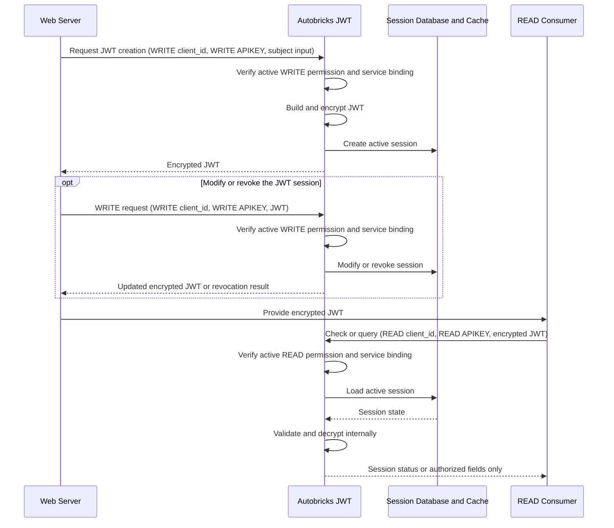

# JWT Client Registration

## Purpose

JWT client registration records a client credential and creates the `client_id`
that identifies that registration. The operator selects one or more credential
types from Unix domain socket, TCP, TLS, and mutual TLS according to the
interfaces enabled by the JWT Service. The registration also assigns exactly
one JWT operation permission: READ or WRITE.

This process does not register a service, issue an APIKEY, or grant access to a
subject data source. Service registration later binds this `client_id` to a
service and issues the APIKEY required to use the permitted JWT operation.

A client registration has exactly one operation class:

| Operation class | Permitted JWT operation |
| --- | --- |
| `READ` | Check session status and query explicitly authorized JWT fields |
| `WRITE` | Create, modify, and revoke an encrypted JWT session |

A consumer that needs both operation classes requires separate READ and WRITE
client registrations.

## Operation Classes

READ and WRITE represent different stages of the JWT session lifecycle. They
are not database read and write permissions and they are not interchangeable.

### Why WRITE Excludes READ

WRITE does not include READ permission. JWT creation, modification, and
revocation change JWT session state and therefore belong to a separate,
higher-risk client area. That area is implemented, deployed, and authorized
independently from clients that only inspect session state or permitted fields.

READ is a common operation used by Web Servers, policy services, and other
registered consumers. These consumers do not require permission to create,
modify, or revoke JWT sessions. Giving every WRITE client implicit READ access,
or giving every READ consumer WRITE access, would combine unrelated privileges
and increase the impact of a compromised client or credential.

READ integration can exist across many application components because session
checks and authorized-field queries are common operations. If a READ client,
READ APIKEY, or READ code path is compromised, the attacker may attempt every
operation exposed to that query identity. The authorization boundary must still
prevent that attacker from creating an arbitrary subject session, replacing an
existing JWT, or revoking another session. For this reason, no READ identity or
READ APIKEY is accepted by a JWT state-changing operation.

The client application, such as a Web Server, must keep WRITE functionality in
a separately controlled security area with its own client registration,
credential, source restrictions, service binding, and APIKEY. Only that client
area should hold and use the WRITE identity required for JWT creation,
modification, or revocation. The more widely deployed READ area must receive
only its separate READ identity and READ APIKEY.

Autobricks JWT does not implement or control the Web Server's internal security
areas. It provides separate READ and WRITE registrations and rejects attempts
to use either permission for the other class. The client owner is responsible
for separating its components, credentials, deployment permissions, and secret
delivery so that compromise of a READ component does not also expose the WRITE
identity.

The separation provides the following security properties:

- A READ client can be deployed broadly without receiving any session-changing
  permission.
- A compromised READ client or READ APIKEY cannot create arbitrary JWT
  sessions.
- A client owner can isolate the WRITE client in the component responsible for
  JWT creation, modification, and revocation.
- Compromise of a READ APIKEY does not grant JWT creation, modification, or
  revocation.
- Compromise of a WRITE APIKEY does not automatically grant field-query or
  session-inspection permission.
- Services under READ and WRITE clients can use separate certificates, source
  restrictions, process identities, and deployment boundaries.
- Operational review can distinguish state-changing activity from common query
  activity.

A component that requires both capabilities registers separate READ and WRITE
clients and receives separate service credentials. It must use the appropriate
client identity and APIKEY for each operation rather than relying on privilege
inheritance between the two classes.

### WRITE

WRITE is the permission to create, modify, and revoke a JWT. Client registration
creates one `client_id` with `operation_class: WRITE`; separate CREATE, UPDATE,
and REVOKE client registrations are not created. Only an active WRITE
`client_id` bound by service registration can request any of these three
operations.

| WRITE operation | Effect |
| --- | --- |
| Create | Create the first encrypted JWT and active session for a subject. |
| Modify | Apply an authorized change to the JWT session and return the resulting encrypted JWT when the operation changes token content. |
| Revoke | Invalidate the active session so the encrypted JWT can no longer be used. |

A Web Server requests JWT issuance with its bound WRITE `client_id`, WRITE
APIKEY, subject identifier, and configured source input. Autobricks JWT verifies
that the client is active, has WRITE permission, and is bound to the same
service as the WRITE APIKEY. It then constructs and encrypts the JWT,
creates the active session, and returns only the encrypted JWT.

The WRITE APIKEY does not create a JWT and does not grant WRITE permission by
itself. It authenticates the service making the issuance request. The WRITE
permission comes from the active WRITE client registration identified by
`client_id`. `ab-jwtd` creates the JWT only after the WRITE client binding, the
service registration, the WRITE APIKEY, and the subject authorization all
match.

The following cannot create, modify, or revoke a JWT:

- A READ `client_id`
- An inactive or deleted WRITE `client_id`
- A WRITE `client_id` that is not bound to the requesting service
- A WRITE `client_id` combined with another service's WRITE APIKEY

The `client_id` identifies the registered permission but is not itself a secret.
Knowing a WRITE `client_id` without the matching registered identity and
WRITE APIKEY does not authorize a WRITE operation.

The WRITE operation class is also distinct from Database mutation. It does not
grant general INSERT, UPDATE, or DELETE permission on an external subject
Database. Database access remains limited to the operations explicitly defined
by the registered service source configuration.

### READ

READ is the permission to inspect an existing JWT session and cannot change its
state. Client registration
creates a separate `client_id` with `operation_class: READ`. A READ request
requires that active READ `client_id` and the READ APIKEY of the service bound
to it. A WRITE `client_id` cannot replace the required READ `client_id`.

READ provides two functions:

- Check whether the JWT belongs to an active, unexpired, non-revoked session.
- Return only the explicitly requested fields authorized for the registered
  service.

Autobricks JWT locates the session, verifies the token and session state,
decrypts the payload only inside the service, and applies the registered field
authorization. A successful authorized lookup extends the sliding retention
time when configured.

A READ client cannot create, modify, or revoke a JWT; create or change a
session; retrieve cryptographic keys; or request the complete decrypted
payload.

### WRITE and READ Relationship

READ depends on an encrypted JWT and active session previously created through
WRITE.



Without a successful WRITE operation, there is no issued JWT or active session
for READ to inspect. An expired, revoked, or nonexistent session produces the
same external invalid-session result and does not expose whether a session once
existed.

When one Web Server needs both lifecycle stages, it receives two client
registrations and two service credentials:

| Lifecycle operation | Client permission | Certificate URI SAN when mTLS is used | APIKEY role |
| --- | --- | --- | --- |
| JWT creation, modification, or revocation | Active WRITE `client_id` | `urn:autobricks:jwt:write` | Authenticate the bound service's WRITE request |
| Status or field lookup | Active READ `client_id` | `urn:autobricks:jwt:read` | Authenticate the bound service's query request |

Possession of one registration or credential never grants the other operation.
The client registration identifies the permitted JWT operation, while
service registration separately defines the subject, source, and field
permissions.

The required authorization intersections are:

| Requested operation | Permission source | Service-request authentication |
| --- | --- | --- |
| Create, modify, or revoke JWT | Active WRITE `client_id` bound to the service | WRITE APIKEY for the same service |
| Check session or query fields | Active READ `client_id` bound to the service | READ APIKEY for the same service |

### Authorization Order

JWT operations apply the connection identity, client permission, and service
credential as separate authorization layers.

1. Validate the credential or peer identity required by the selected transport.
2. Resolve the authenticated connection to an active registered `client_id`.
3. Confirm that the `client_id` has the required WRITE or READ permission.
4. Confirm that service registration binds that `client_id` to the requesting
   service.
5. Authenticate the APIKEY issued by that service registration.
6. Apply the registered subject, source, and field permissions.
7. Allow `ab-jwtd` to create the JWT or process the session query.

For Unix domain sockets, the first layer validates local socket access and the
registered peer credentials. TCP and TLS validate the connecting source against
the registered source CIDR; TLS also establishes the server-authenticated
encrypted channel. Mutual TLS validates the client certificate chain, validity,
purpose, AIA OCSP status, registered fingerprint, and operation URI SAN, and
also enforces the registered source CIDR.

Passing one layer never bypasses another. A valid certificate or peer identity
without the correct `client_id` and APIKEY cannot use a JWT operation. A valid
APIKEY combined with an unregistered, inactive, or incorrectly permitted
`client_id` is also rejected.

## Management Path

Registration is available only through the local management path.

```text
Operator
   │
   ▼
ab-jwt-cli
   │  restricted client-facing Unix domain socket
   ▼
autobricks-jwt-cli.service
   │  restricted server-management Unix domain socket
   ▼
ab-jwtd
```

The `ab-jwt-cli` process sends the management request to the client service.
The client service verifies the caller's Unix peer credentials, authorizes and
filters the request, and forwards only an accepted registration request to
`ab-jwtd`. Interactive users cannot connect directly to the server-management
socket.

Neither management socket is world-accessible. Parent-directory ownership,
socket mode `0660` or stricter, administrator and service groups, and Unix peer
credential verification are all required. TCP, TLS, and mutual TLS JWT data
interfaces do not expose client-management operations.

## Preconditions

- `autobricks-jwt.service` and `autobricks-jwt-cli.service` are running.
- The caller is authorized to use the client-facing management socket.
- At least one JWT service transport is enabled.
- Autobricks Cache is installed and valid as required by the service.
- TLS and mutual TLS are selectable only when the Autobricks PKI client and the
  required JWT Service certificate configuration are available.

## Registration Input

The operator enters:

- Client name
- Operation class: `READ` or `WRITE`

The client name contains 1–63 lowercase letters, digits, or hyphens.

### Client Credential Types

Client registration supports four credential types:

| Credential type | Registered client credential |
| --- | --- |
| Unix domain socket | Local socket access permission and operating-system peer UID with optional GID |
| TCP | Connecting source address within the registered source CIDR |
| TLS | Connecting source address within the registered source CIDR after establishment of the server-authenticated TLS channel |
| Mutual TLS | Service-specific certificate validated by chain, validity, purpose, AIA OCSP status, registered fingerprint, and operation URI SAN |

The selected type defines how the client reaches the JWT Service and which
connection evidence is checked before the `client_id` and service APIKEY are
authorized. The `client_id` identifies the registration but is not itself the
credential. TCP authenticates the client source with the registered source
CIDR. TLS adds server authentication and channel encryption while retaining the
registered source CIDR as the client credential. Mutual TLS uses a
service-specific certificate as the connection credential and binds its
verified fingerprint to `service_id`. The service remains bound to the parent
`client_id` and its operation URI SAN.

Source CIDR remains mandatory for every registration, including Unix domain
socket and mutual TLS registrations. For mutual TLS it is an additional source
restriction, not a replacement for or part of the certificate credential.

### Credential Security Levels

The credential type represents how the client accesses the JWT Service and how
the connection establishes the client's identity.

| Credential type | Security characteristics | Network credential level |
| --- | --- | --- |
| Unix domain socket | Local-only access controlled by socket filesystem permissions and verified operating-system peer credentials | Local trust boundary |
| TCP | Client source is restricted by the registered source CIDR; the transport itself provides neither encryption nor certificate identity | Basic |
| TLS | Adds encryption and JWT server authentication; the client remains identified by its registered source CIDR | Protected |
| Mutual TLS | Adds encryption, JWT server authentication, client certificate authentication, fingerprint binding, URI SAN permission, and current OCSP validation | Highest network level |

Mutual TLS is the strongest network credential type because the client must
prove possession of the private key corresponding to its registered
certificate, and the JWT Service verifies both the certificate's trust status
and its binding to the registered client permission. Source CIDR remains an
additional restriction rather than the primary mTLS identity.

Unix domain socket access uses a separate local-host trust boundary and is not
a weaker form of network TLS. It is appropriate only for authorized local
processes whose socket access and peer credentials are controlled by the
operating system.

The connection credential does not replace service authorization. After the
credential succeeds, the JWT Service still requires the registered `client_id`
and the APIKEY issued to the service bound to that client.

Only credential types enabled by the JWT Service and available under the active
dependency profile can be assigned. A type omitted from the server's enabled
set cannot be registered or silently substituted.

Multiple credential types may be assigned to one client registration. For example,
a server started with Unix domain socket and TLS support can authorize both for
the same registered client. A server that enables only mutual TLS permits only
mutual TLS selection.

### Connection Settings

Every registration requires:

- Source CIDR
- Client-specific keep-alive timeout in seconds

Source CIDR is mandatory for every transport. Host input is normalized to its
network representation before storage. The keep-alive timeout must be a
positive supported integer and overrides the server default for this client.

When Unix domain socket is selected, the registration also requires the peer
UID and may include a peer GID. The server verifies operating-system peer
credentials when that transport is used.

## Mutual TLS Certificate Capability

Selecting mutual TLS permits services under this `client_id` to receive
service-specific certificates. It does not issue a certificate during client
registration because no `service_id` exists yet. Certificate provisioning
occurs separately for every service registration, and each certificate
contains exactly one JWT operation URI SAN.

| Operation class | Required URI SAN |
| --- | --- |
| `READ` | `urn:autobricks:jwt:read` |
| `WRITE` | `urn:autobricks:jwt:write` |

The complete provisioning and delivery procedure is defined in
[Service Certificate](16-service-certificate.md).

TLS without mutual TLS does not issue a client certificate. It uses the JWT
Service server certificate for transport protection; later JWT operations still
require the applicable service APIKEY.

## Registration Request

The accepted registration request uses the following structure.

```json
{
  "allowed_source_cidr": "10.10.254.0/24",
  "client_name": "web-server-write",
  "keep_alive_timeout": 3600,
  "operation_class": "WRITE",
  "transports": [
    "UNIX",
    "MTLS"
  ],
  "peer_uid": 1001,
  "peer_gid": 1001
}
```

Transport-specific fields are omitted when they do not apply. JSON `null`
placeholders are not emitted.

## Registration Response

The registration response returns the created client identity. Certificate
information is returned later by service registration.

```json
{
  "client_id": "53f6bd4c-fe3d-494b-ae27-4ba66fdfb87a",
  "client_name": "web-server-write",
  "created_at": "2026-10-09T05:11:48Z",
  "operation_class": "WRITE",
  "transports": [
    "UNIX",
    "MTLS"
  ]
}
```

The request and response remain separate contracts. Generated identifiers,
timestamps, certificate metadata, and file paths belong only to the response.

## Stored State

`ab-jwtd` stores the client registration in the SQLCipher `clients` table. The
record contains the information required to enforce the registration,
including:

- Generated client ID
- Unique client name
- Operation class
- Enabled transports
- Required source CIDR
- Client-specific keep-alive timeout
- Unix peer UID and optional GID when applicable
- Active registration state
- Creation and modification timestamps

Service certificate state is stored separately because one client can own
multiple service registrations and each service can have its own certificate.

## Runtime Enforcement

Registration alone does not authorize a JWT operation. Runtime permission is
the intersection of the active client registration, transport identity,
certificate identity when applicable, URI SAN operation, registered service,
and request APIKEY operation.

For mutual TLS, connection acceptance requires all of the following:

- Trusted certificate chain
- Valid certificate time interval and client-authentication purpose
- Usable AIA OCSP responder URL
- Current, valid, signed OCSP status of `GOOD`
- Exact match to the registered SHA-256 fingerprint
- Exact match between URI SAN and registered operation class
- Active service certificate, service, and parent client records
- Source address within the registered CIDR

A certificate issued by the PKI but not present in an active service-certificate
record is not authorized.

## Failure Handling

The following errors apply while creating a client registration.

| Code | Name | Exposure | Registration behavior |
| ---: | --- | --- | --- |
| 8000 | `INTERNAL_ERROR` | Generic | Return a redacted failure when registration cannot complete for an undisclosed internal reason. |
| 8001 | `INVALID_REQUEST` | Public | Reject an invalid client name, operation class, transport set, source CIDR, timeout, UID, or GID. |
| 8002 | `UNSUPPORTED_OPERATION` | Public | Reject an unknown or unsupported management operation. |
| 8006 | `REQUEST_TIMEOUT` | Public | Reject a registration that exceeds the management request deadline. |
| 8009 | `SERVICE_UNAVAILABLE` | Generic | Reject registration when a required management or dependency service is temporarily unavailable. |

## Logging and Audit

Client registration failures and service diagnostics are written to the
operating server's syslog with the assigned error code and redacted context.
APIKEYs, private keys, certificate contents, and database credentials are never
logged.

JWT client registration does not create a TrueLog audit event under
the JWT Service. It does not write a TrueLog record or create a TrueLog receipt.

Service certificate issuance and renewal begin after service registration. See
[Service Certificate](16-service-certificate.md) and
[Certificate Renewal](15-certificate-renewal.md).
