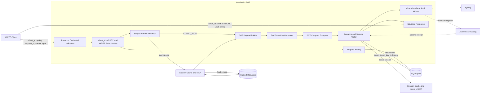
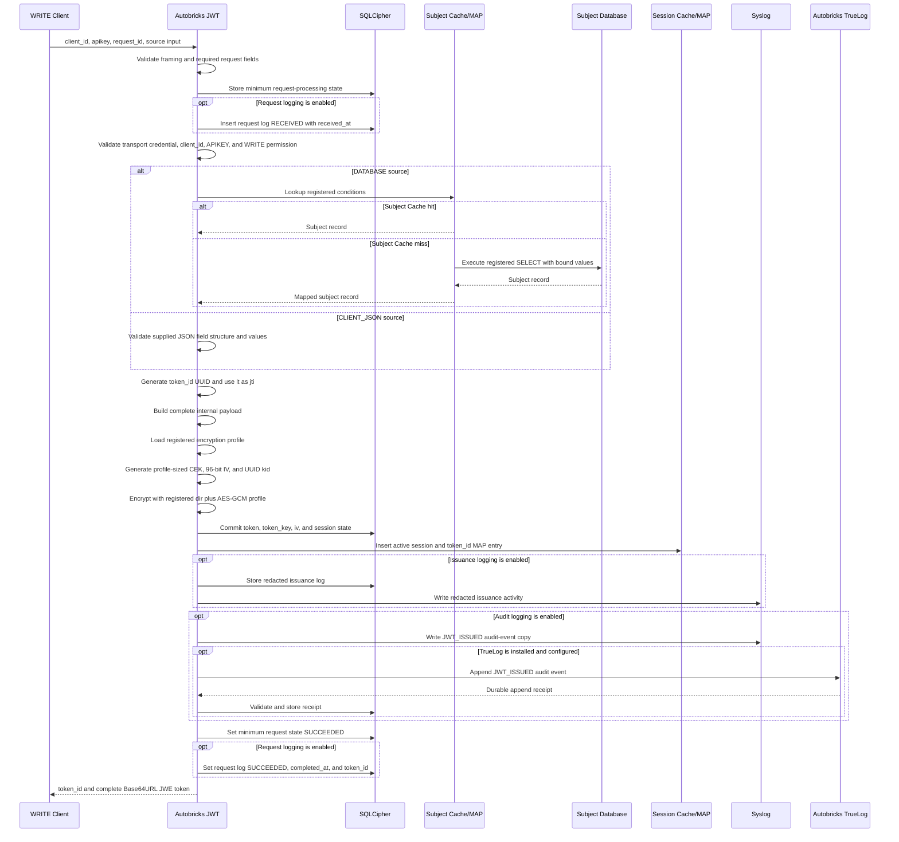

# Service JSON Web Token Issuance

## Purpose

JWT issuance is a runtime service operation. It has no management or curses
screen. A registered WRITE client sends an issuance request over one of the
service transports supported by its client registration.

The operation authenticates the connection credential, `client_id`, and
APIKEY; resolves the registered subject source; creates an encrypted JWT and an
active session; stores the session through Autobricks Cache; writes the
operational and audit records; and returns the opaque token.

## Preconditions

Issuance requires all of the following:

- The connection satisfies the registered UNIX, TCP, TLS, or mTLS credential.
- The `client_id` exists, is active, and has WRITE permission.
- The service registration exists, is active, and is bound to that `client_id`.
- The APIKEY is active and bound to the same service, `client_id`, and WRITE
  operation class.
- The WRITE service has one active JWT encryption profile and the APIKEY is
  bound to that same profile.
- The request subject type matches the service registration.
- Exactly one subject source, `DATABASE` or `CLIENT_JSON`, is configured.
- The token-key store, SQLCipher history Database, and Autobricks Cache are
  available.

A READ `client_id` or READ APIKEY can never issue a JWT.

## Request Authentication

Authentication is evaluated in layers. Passing one layer does not bypass the
remaining layers.

1. Authenticate the connection using its registered transport credential.
2. Resolve the active client registration from `client_id`.
3. Confirm that the authenticated connection identity belongs to that client.
4. Authenticate the APIKEY and confirm that it belongs to the same service and
   `client_id`.
5. Require WRITE permission across the connection identity, client
   registration, APIKEY, and requested operation.
6. Confirm that the service registration permits the requested subject type
   and source mode.

For mTLS, the connection layer also validates the certificate chain, validity,
client-authentication purpose, AIA OCSP `GOOD` status, registered fingerprint,
and WRITE URI SAN before APIKEY authentication.

## Request

Every request supplies at least `client_id`, `apikey`, a client-generated
`request_id`, and the token-generation conditions. The service registration
already determines the service, WRITE operation class, subject type, and source
mode; the runtime caller cannot override them. It also cannot submit or override
the registered JWT encryption profile or JOSE algorithm parameters.

`request_id` is required. Autobricks JWT does not generate a JWT for a request
that omits it or supplies an invalid value. The identifier is unique within the
registered client and is stored with the request-processing state and resulting
token record. When request logging is enabled, it is also stored in the request
log.

### DATABASE Source Request

A DATABASE request supplies values for the already registered SELECT conditions.
It never supplies SQL, a table name, a Connection definition, or a Cache
definition.

`conditions` is always an array of `field` and `value` objects. A SELECT with
one input field uses a one-element array:

```json
{
  "operation": "JWT_CREATE",
  "request_id": "c2de26c8-5f40-4739-9298-1583ff40d338",
  "client_id": "53f6bd4c-fe3d-494b-ae27-4ba66fdfb87a",
  "apikey": "<write-apikey>",
  "conditions": [
    {
      "field": "user_id",
      "value": "user-1001"
    }
  ]
}
```

If the registered SELECT declares multiple input fields, the array contains one
entry for each registered field:

```json
{
  "operation": "JWT_CREATE",
  "request_id": "c2de26c8-5f40-4739-9298-1583ff40d338",
  "client_id": "53f6bd4c-fe3d-494b-ae27-4ba66fdfb87a",
  "apikey": "<write-apikey>",
  "conditions": [
    {
      "field": "tenant_id",
      "value": "tenant-01"
    },
    {
      "field": "user_id",
      "value": "user-1001"
    }
  ]
}
```

For a registered field list of `tenant_id, user_id`, `tenant_id` is bound to
`$1` and `user_id` is bound to `$2`. Autobricks JWT matches condition entries by
their `field` value and orders the bindings according to the registered
`select.fields` list. Array order does not change SQL parameter order. Missing,
additional, duplicated, empty, or invalid condition fields are rejected. Each
`value` must satisfy the Database Driver and registered source requirements.

The request cannot supply an SQL operator, expression, column name outside the
registered field list, or raw SQL fragment. The registered SELECT remains the
only executable statement; `conditions` supplies only its parameter values.

The configured Cache MAP is checked first. On a miss, Autobricks Cache executes
the single registered SELECT using the supplied condition values and registers
the returned Database record in its configured MAPs. Autobricks JWT uses the
mapped result columns as the subject fields from which it constructs the
encrypted payload.

### CLIENT_JSON Source Request

A CLIENT_JSON request supplies the subject fields directly:

```json
{
  "operation": "JWT_CREATE",
  "request_id": "c2de26c8-5f40-4739-9298-1583ff40d338",
  "client_id": "53f6bd4c-fe3d-494b-ae27-4ba66fdfb87a",
  "apikey": "<write-apikey>",
  "data": {
    "id": "1001",
    "user_id": "user-1001",
    "last_ip": "192.0.2.10",
    "role": "member"
  }
}
```

The supplied object must satisfy the field names, required fields, value types,
and limits defined by the service registration. Unregistered fields and missing
required fields are rejected. CLIENT_JSON input does not cause a Database
lookup and cannot override the registered subject type, service, audience,
expiration, `jti`, or other JWT-controlled metadata.

The WRITE client is responsible for the correctness and integrity of the
subject data it supplies. Autobricks JWT validates the registered structure but
does not independently verify those values against a Database.

## SQLCipher Request State and Optional Request Log

Autobricks JWT retains the minimum SQLCipher request state required to enforce
`request_id` idempotency and preserve the relationship to the resulting token.
When request logging is enabled, it also creates a request log before token
generation begins. The optional log records when the request arrived
independently of whether issuance later succeeds or fails and is subject to the
90-day Log Drain contract.

The enabled request log contains at least:

| Field | Required | Meaning |
| --- | --- | --- |
| `request_id` | Yes | Identifier supplied by the client |
| `client_id` | Yes | Client identifier supplied by the request |
| `service_id` | Conditional | Service resolved after APIKEY and binding validation |
| `operation` | Yes | Resolved operation definition; `JWT_CREATE` for this process |
| `received_at` | Yes | UTC time at which the complete request was accepted for processing |
| `status` | Yes | `RECEIVED`, `SUCCEEDED`, `REJECTED`, or `FAILED` |
| `completed_at` | Conditional | UTC time at which processing reached a final state |
| `error_code` | Conditional | Assigned JWT error code when processing does not succeed |
| `jti` | Conditional | Resulting session identifier after successful issuance |

The APIKEY and raw token-generation conditions are used during processing but
are not stored in the request log. They may contain credentials or subject
information and must not appear in request-log diagnostics.

The pair of `client_id` and `request_id` is unique within the enforced
idempotency window. A repeated request must not silently create an additional
token. Duplicate-request response and retry behavior must preserve the original
request and token relationship independently of whether request logging is
enabled.

## Validation

Before creating a session, Autobricks JWT validates:

- The JWT creation request and protocol structure.
- The required `request_id` format and request-processing limits.
- The complete credential, `client_id`, APIKEY, and WRITE permission chain.
- The registered subject type and source mode.
- The source conditions or CLIENT_JSON field contract.
- The maximum request and generated-payload sizes.
- The source result count and required result columns.
- The configured expiration and session limits.

A DATABASE source must resolve to exactly one valid subject record unless the
service registration explicitly defines another cardinality. No result,
multiple unexpected results, missing required columns, or an invalid value
prevents issuance.

## Autobricks JWT Profile

Autobricks JWT represents every issued token as a JWE Compact Serialization in
accordance with RFC 7519, RFC 7516, RFC 7518, and RFC 8725. The profile uses
authenticated encryption so the payload remains confidential and any protected
header or ciphertext modification causes validation failure.

### Serialization and Algorithms

The WRITE service registration selects one of the profiles defined by
[Service Registration](02-service-registration.md#jwt-encryption-profile-selection).
The stored service profile, not the runtime caller, supplies every JOSE
algorithm parameter used during issuance.

| Profile | `alg` | `enc` | Content-encryption key |
| --- | --- | --- | ---: |
| `JWE_DIR_A128GCM` | `dir` | `A128GCM` | 128 random bits |
| `JWE_DIR_A192GCM` | `dir` | `A192GCM` | 192 random bits |
| `JWE_DIR_A256GCM` | `dir` | `A256GCM` | 256 random bits |

Every profile uses JWE Compact Serialization, `typ: autobricks+jwt`, a new
96-bit random IV for each encryption operation, a 128-bit AES-GCM authentication
tag, UTF-8 JSON payloads, and no compression. The content-encryption key is
generated independently for each token version and has the exact size required
by the selected `enc` value.

`dir` uses the token-specific content-encryption key directly. The JWE Encrypted
Key component is therefore empty, while its position and surrounding period
separators remain present in the compact value.

Autobricks JWT does not produce an unsecured JWT, JWS, Nested JWT, JWK, or JWK
Set for this service profile. JWE authenticated encryption protects the token
inside the JWT Service trust boundary; it does not represent a separate
third-party issuer signature. Token keys remain internal SQLCipher secrets and
are never published as JWK values.

### Protected Header

The protected header contains exactly these members. This example shows the
`JWE_DIR_A256GCM` profile:

```json
{
  "alg": "dir",
  "enc": "A256GCM",
  "typ": "autobricks+jwt",
  "kid": "<token-key-uuid>"
}
```

All four members are required. Their names and string values are matched
exactly. `alg` and `enc` must equal the profile stored for the issuing service.
`kid` is a UUID assigned to the internal token-key record; it selects a
candidate local key but never establishes trust by itself.

The profile rejects additional protected-header members and specifically
rejects `crit`, `jku`, `jwk`, `x5u`, `x5c`, `x5t`, `x5t#S256`, and `zip`.
Autobricks JWT never retrieves a key or other resource from a URI supplied by a
token. JWE Compact Serialization has no shared or per-recipient unprotected
header in this profile.

### Required Claims

The plaintext claims object contains these required members:

| Claim | Type | Rule |
| --- | --- | --- |
| `iss` | String | Exactly `autobricks-jwt` |
| `sub` | String | Nonempty subject identifier resolved under the registered subject type |
| `aud` | String | Exactly the `service_id` authorized by the APIKEY and WRITE client |
| `iat` | NumericDate | Integer Unix epoch time in seconds at issuance |
| `nbf` | NumericDate | Equal to `iat` |
| `exp` | NumericDate | Equal to `iat` plus the registered absolute token lifetime |
| `jti` | String | UUID equal to the externally returned `token_id` |
| `subject_type` | String | Registered `USER`, `DEVICE`, or `WORKLOAD` subject type |
| `claims` | Object | Registered Database result or validated CLIENT_JSON fields |

NumericDate values are nonnegative integer seconds since
`1970-01-01T00:00:00Z`. Fractional values, strings, booleans, and null values are
rejected for `iat`, `nbf`, and `exp`. The service accepts a token only while
`nbf <= now < exp`; this profile does not apply clock-skew leeway because the
same JWT Service issues and validates the token.

JWT-controlled claims cannot be supplied or replaced by Database columns,
CLIENT_JSON data, or `JWT_UPDATE`. Application fields exist only below the
`claims` object. Claim names are unique; duplicate JSON member names are
rejected rather than resolved by first-member or last-member precedence.

The protected header and payload must decode as valid UTF-8 JSON objects within
the registered size and nesting limits. Invalid UTF-8, invalid JSON, duplicate
members, unsupported members, excessive nesting, or an oversized protected
header or payload causes token rejection.

## Processing

Issuance follows this order:

1. Validate the framing, required `client_id`, `request_id`, and minimum request
   structure without persisting the APIKEY or condition values.
2. Create the minimum SQLCipher request-processing state and, when request
   logging is enabled, insert the request log with `received_at` and `RECEIVED`.
3. Authenticate and authorize the connection, client, service, APIKEY, and
   WRITE operation. A rejection updates the minimum request state and the
   enabled request log.
4. Validate the registered subject source and token-generation conditions.
5. Resolve the subject record from the configured Cache/MAP and Database SELECT,
   or validate the supplied CLIENT_JSON object.
6. Generate a unique UUID `token_id` and store the same value as the JWT `jti`
   so one external lookup identifier maps to exactly one internal JWT session.
7. Generate the remaining required JWT-controlled fields: `iss`, `sub`, `aud`,
   `iat`, `nbf`, `exp`, `jti`, `subject_type`, and `claims`.
8. Construct the complete plaintext payload only inside Autobricks JWT.
9. Load the JWT encryption profile stored for the authorized WRITE service and
   require it to match the profile bound to the APIKEY.
10. Generate a new cryptographically random content-encryption key of the size
    required by that profile and a new random 96-bit IV for this token version.
    Neither value is reused for another encryption operation.
11. Encrypt the UTF-8 payload using the profile's `alg: dir` and selected
    AES-GCM `enc`, authenticate the protected header as JWE Additional
    Authenticated Data, produce a 128-bit authentication tag, and assign a
    unique UUID `kid` to the SQLCipher key record.
12. Commit the encrypted token, recoverable token-specific encryption key,
   token/session state, and successful request relationship to SQLCipher.
   SQLCipher protects the key at rest.
13. Insert the active session into Autobricks Cache with `token_id` as its
    required Session MAP key.
14. When issuance logging is enabled, write the redacted issuance activity to
    its SQLCipher log and syslog.
15. When audit logging is enabled, create the `JWT_ISSUED` audit event. Write
    its operational copy to syslog and, when TrueLog is installed and
    configured, append it to TrueLog, validate its receipt, and store that
    receipt in the corresponding local audit record.
16. Set the minimum request state to `SUCCEEDED`; when request logging is
    enabled, store its `completed_at` and `token_id` in the request log. Return
    both `token_id` and the encrypted token without returning the plaintext
    payload.

The plaintext payload, APIKEY, JWT key, source record, token, and `jti` are not
written to syslog or TrueLog.

## Issuance Block Diagram



## Issuance Sequence Diagram



## Internal Payload

The logical plaintext payload exists only inside Autobricks JWT:

```json
{
  "iss": "autobricks-jwt",
  "sub": "user-1001",
  "subject_type": "USER",
  "aud": "<registered-service-id>",
  "iat": 0,
  "nbf": 0,
  "exp": 0,
  "jti": "<session-id>",
  "claims": {
    "id": "1001",
    "user_id": "user-1001",
    "last_ip": "192.0.2.10",
    "role": "member"
  }
}
```

The caller cannot request generated JWT metadata through source input. The
complete object is encrypted before it crosses the JWT Service boundary.

## SQLCipher Token State and Optional Issuance Log

Every successfully generated token is stored in the JWT Service's SQLCipher
Database before it is returned. SQLCipher is the durable token, key, and
session-state store; Autobricks Cache is the active-session acceleration and
Retention layer. This required token state is independent of the optional
issuance log.

The persisted token record contains at least these required fields:

| Field | Required | Meaning |
| --- | --- | --- |
| `client_id` | Yes | WRITE client registration that authorized issuance |
| `service_id` | Yes | Service registration bound to the client and APIKEY |
| `request_id` | Yes | Identifier supplied for this issuance request |
| `token_id` | Yes | UUID returned to the client and mapped one-to-one to the JWT |
| `token` | Yes | Complete encrypted token returned by issuance |
| `token_key` | Yes | Recoverable token-specific content-encryption key stored as secret binary data |
| `iv` | Yes | 96-bit initialization vector used for this token version, stored as 12 binary bytes |
| `issued_at` | Yes | UTC time at which this token was issued |

`token_id` and the JWT payload's `jti` contain the same UUID. This avoids two
independent session identifiers while preserving a client-visible lookup key.

`issued_at` is the canonical field name; the persistent contract does not use
`create_at`. The record also stores the identifiers and state needed to validate
and manage the token:

- The unique `jti` and `kid` token-key identifier.
- The complete encrypted token and a token digest used for protected matching.
- The token-specific content-encryption key as secret key material that
  Autobricks JWT can recover after opening SQLCipher through its HSM-managed
  Database-key path.
- The 96-bit IV decoded from the JWE Initialization Vector component and stored
  as 12 binary bytes for exact validation of the token version.
- The registered service, WRITE `client_id`, and subject type bindings.
- Issue time, absolute expiration, current session state, and revocation time
  when applicable.
- The token processing state.

When issuance logging is enabled, a separate redacted issuance log records the
permitted identifiers, result, and timestamps for no more than 90 days. When
audit logging is enabled, the separate local audit record contains its audit
state and validated TrueLog receipt when available. Neither optional log is
required to validate an active token.

The complete plaintext payload is not persisted. The token, token encryption
key, and receipt are never written to syslog or TrueLog.

The SQLCipher Database key is obtained through the HSM-managed key path already
defined for Autobricks JWT. Each token nevertheless has its own independent
random content-encryption key. SQLCipher encryption protects the stored token
records and token keys at rest; it does not cause multiple tokens to share one
content-encryption key. The token key must remain recoverable by Autobricks JWT
for as long as the token can be validated, queried, modified, or revoked.

A conceptual token-key record contains:

```json
{
  "kid": "<unique-token-key-id>",
  "jti": "<session-id>",
  "content_encryption_key": "<secret-binary-value>",
  "encryption_profile": "JWE_DIR_A256GCM",
  "key_management_algorithm": "dir",
  "content_encryption_algorithm": "A256GCM",
  "created_at": "<utc-timestamp>",
  "expires_at": "<utc-timestamp>",
  "status": "ACTIVE"
}
```

This is a logical SQLCipher record, not an API response or log format. The
`content_encryption_key` column is secret data made available only inside
`ab-jwtd` after SQLCipher has been opened successfully.

A conceptual required token record therefore includes:

```json
{
  "client_id": "53f6bd4c-fe3d-494b-ae27-4ba66fdfb87a",
  "service_id": "<registered-service-id>",
  "request_id": "c2de26c8-5f40-4739-9298-1583ff40d338",
  "token_id": "73475423-3470-4da3-b702-0d234b3632cd",
  "jti": "73475423-3470-4da3-b702-0d234b3632cd",
  "kid": "<unique-token-key-id>",
  "token": "<base64url-jwe-compact-token>",
  "token_key": "<secret-binary-value>",
  "iv": "<12-byte-binary-value>",
  "issued_at": "2026-01-01T00:00:00Z",
  "expires_at": "2026-01-01T01:00:00Z",
  "status": "ACTIVE"
}
```

The JSON above documents logical fields only. `token_key` is a protected
SQLCipher secret column and is never serialized into an API response, syslog,
TrueLog event, diagnostic dump, or receipt. `iv` is not a secret, but it remains
internal token-version metadata and is not returned as a separate response
field or written to logs.

Issuance-history creation and initial session-state creation are one atomic
Database transaction. Autobricks JWT does not return a token when that
transaction fails. If the following Cache insertion fails, the token is not
returned and the persisted issuance record is retained in a failed or inactive
state for diagnosis rather than being presented as an active issued session.

## Session Cache and MAP

Every successfully issued token has one active session record in Autobricks
Cache. The minimum record contains the generated `token_id`, matching `jti`, service binding,
subject type, issue time, absolute expiration, active state, and the persistence
state required by the JWT service.

The Session Cache requires a `token_id` MAP so later token operations can find
the active session without first decrypting the token or querying SQLCipher.
The active key and session records may be cached internally, but SQLCipher
remains their durable source. The raw token is not used as a logged or
operator-configured MAP key.

## Later Token Validation

Every later operation supplies `token_id`. Modification also supplies the
complete encrypted `token`. Query and revocation supply the token when the
server installation enables `require_token_for_query_and_revoke`; otherwise
the service can resolve the stored token from `token_id`. Autobricks JWT
validates the selected token as follows:

1. Validate `token_id` as a UUID and look it up in the active Session Cache MAP.
2. When a token is supplied, compare its digest with the digest bound to that
   session record. When query or revocation omits it under token-optional mode,
   select the stored token bound to the session record.
3. Require exactly five JWE Compact components and canonical unpadded Base64URL
   encoding for every nonempty component.
4. Decode the protected header as a UTF-8 JSON object with unique member names,
   without treating any value as trusted.
5. Require exactly `alg`, `enc`, `typ`, and `kid`; require `dir`,
   `autobricks+jwt`, and the AES-GCM `enc` value stored in the service and token
   records; reject every unsupported or additional header member.
6. Require the Encrypted Key component to be empty because `alg` is `dir`.
7. Validate `kid` as a UUID and resolve the matching active token-key record from
   the internal key cache or SQLCipher without performing any external lookup.
8. Require the key record to specify the registered profile, `dir`, the matching
   AES-GCM algorithm, its required 128-bit, 192-bit, or 256-bit key size, the
   same service and token binding, and an active key state.
9. Require a 96-bit IV, require its decoded 12 bytes to equal the IV stored with
   the token version, and require a 128-bit authentication tag. Authenticate the
   exact encoded protected-header component as JWE Additional Authenticated Data
   and verify the AES-GCM tag before making plaintext available to any parser or
   operation.
10. Decode the authenticated plaintext as one UTF-8 JSON object with unique
    member names and the required claims defined by this profile.
11. Require `iss` to equal `autobricks-jwt`, `aud` to equal the registered
    `service_id`, `sub` to be valid for the registered subject type, `jti` to
    equal the supplied `token_id`, and `subject_type` to match the service and
    issuance records.
12. Require integer NumericDate values, `nbf == iat`, `iat <= now`, and
    `nbf <= now < exp`; require `exp` to match the absolute expiration stored in
    SQLCipher.
13. Match the `kid`, service binding, token digest, issuance record, and active
    Cache session, then apply idle Retention.

An unknown `token_id`, submitted-token mismatch, unknown `kid`, missing key, key/session
mismatch, authentication-tag failure, token-digest mismatch, or invalid session
prevents all query, modification, and revocation operations. `token_id` only
accelerates lookup and never replaces validation of the complete token.

This Session MAP is owned and configured by `ab-jwtd`. It is separate from the
subject-source MAP configured during service registration and is not an input
in process 02.

A session is considered issued only after its SQLCipher record and Cache record
have both been created successfully. Cache is not the only copy of token state.
A later missing or expired Cache record is treated as an invalid session and is
not restored merely because its SQLCipher token record exists. Expiration or
eviction removes active Cache access while preserving durable token state
according to its lifecycle.

## Response

Successful issuance returns the opaque encrypted token as a JSON string:

```json
{
  "token_id": "73475423-3470-4da3-b702-0d234b3632cd",
  "token": "<base64url-jwe-compact-token>"
}
```

`token` uses JWE Compact Serialization. It is an ASCII-safe string consisting
of five component positions separated by `.` characters:

```text
BASE64URL(protected-header)
.
<empty-encrypted-key>
.
BASE64URL(initialization-vector)
.
BASE64URL(ciphertext)
.
BASE64URL(authentication-tag)
```

With `alg: dir`, the second component is empty and the serialized token has this
shape:

```text
BASE64URL(protected-header)..BASE64URL(iv).BASE64URL(ciphertext).BASE64URL(tag)
```

Base64URL uses the URL-safe alphabet and omits `=` padding. The complete token
is not encoded again as one additional Base64 value; each nonempty JWE component
is individually Base64URL encoded and the five component positions form the
returned `token`.

The response does not contain source fields, decrypted claims, cryptographic
keys, a TrueLog event, or a TrueLog receipt. The token and `token_id` are
supplied together to later status, authorized-field query, modification, and
revocation requests. Neither value alone authorizes those operations; each
request repeats its own credential, `client_id`, APIKEY, permission, service,
and session checks.

## State Changes

Successful issuance creates:

- One minimum SQLCipher request-state record linked by `request_id`.
- One durable SQLCipher token, key, IV, and session-state record.
- One active Cache session and its Session MAP entry.
- When request logging is enabled, one SQLCipher request log.
- When issuance logging is enabled, one SQLCipher issuance log and its redacted
  syslog activity entry.
- When audit logging is enabled, one `JWT_ISSUED` syslog audit-event copy and,
  when TrueLog is configured, one TrueLog event with its validated receipt
  stored in the corresponding local audit record.

A rejected request does not create a session or `JWT_ISSUED` audit event.
Classified failures are written to syslog using their assigned error code and
safe redacted context.

## Logging and Audit

The successful event format is defined by `LOGGING.md`:

```json
{
  "event": "JWT_ISSUED",
  "service_id": "<registered-service-id>",
  "subject_type": "USER",
  "result": "SUCCESS",
  "event_at": "2026-01-01T00:00:00Z"
}
```

When audit logging is enabled, the event is written to syslog and, when
available, Autobricks TrueLog. The syslog copy is operational visibility and is
not audit evidence. The TrueLog append and locally stored receipt are the audit
evidence.

With audit logging enabled but without an installed and configured TrueLog
client, issuance writes the audit-event copy only to syslog and does not
fabricate an audit receipt. An enabled TrueLog delivery or receipt-storage
failure follows the audit failure and reconciliation rules in `LOGGING.md`.

## Errors

The issuance path uses the assigned errors from `ERROR.md`, including:

| Code | Name | Issuance use |
| ---: | --- | --- |
| 8001 | `INVALID_REQUEST` | Malformed or inconsistent issuance input |
| 8004 | `REQUEST_TOO_LARGE` | Request or generated payload exceeds its limit |
| 8006 | `REQUEST_TIMEOUT` | Issuance exceeds its processing deadline |
| 8030 | `APIKEY_AUTHENTICATION_FAILED` | APIKEY is missing, invalid, revoked, or incorrectly bound |
| 8031 | `APIKEY_OPERATION_FORBIDDEN` | APIKEY does not allow WRITE issuance |
| 8032 | `OPERATION_CLASS_MISMATCH` | Credential, client, and APIKEY operation classes disagree |
| 8040 | `SERVICE_NOT_REGISTERED` | No matching active service registration exists |
| 8041 | `SERVICE_REGISTRATION_INACTIVE` | The matching service registration is inactive |
| 8042 | `SUBJECT_TYPE_FORBIDDEN` | The subject type is not registered for the service |
| 8050 | `JWT_ISSUANCE_FAILED` | Safe generic issuance failure returned to the caller |
| 8051 | `INVALID_SUBJECT` | The supplied subject conditions or identity are invalid |
| 8052 | `SOURCE_NOT_CONFIGURED` | The requested source differs from the registered source |
| 8053 | `SOURCE_DATA_UNAVAILABLE` | Required source data cannot be obtained |
| 8054 | `SOURCE_DATA_INVALID` | Source data cannot produce the configured payload |
| 8055 | `JWT_ENCRYPTION_FAILED` | Internal encryption failure |
| 8056 | `SESSION_CREATE_FAILED` | Cache or persisted session creation did not complete |
| 8070 | `AUDIT_WRITE_FAILED` | Configured TrueLog append failed |
| 8071 | `AUDIT_RECEIPT_INVALID` | TrueLog returned an invalid receipt |
| 8072 | `AUDIT_RECEIPT_STORE_FAILED` | Receipt persistence failed |
| 8073 | `AUDIT_RECONCILIATION_REQUIRED` | Audit append may have succeeded but receipt storage is incomplete |
| 8080 | `DATABASE_UNAVAILABLE` | A required Database is unavailable |
| 8082 | `CACHE_UNAVAILABLE` | Autobricks Cache is unavailable |
| 8084 | `KEY_STORE_UNAVAILABLE` | The protected key store is unavailable |
| 8085 | `HSM_UNAVAILABLE` | A required HSM operation is unavailable |

Internal errors are mapped to their documented safe public response. Every
classified failure writes its root `error_code` and `error_name` to syslog.

## Security Boundaries

- Only a fully authorized WRITE registration can issue a token.
- Runtime requests cannot supply SQL or change a registered source definition.
- CLIENT_JSON cannot override JWT-controlled metadata.
- The complete plaintext payload remains inside Autobricks JWT during normal
  service processing; only the privileged local inspection path can return it
  to an authenticated root administrator.
- Every token uses a newly generated content-encryption key; token keys are not
  shared between issued tokens.
- SQLCipher stores the encrypted token, recoverable token key, IV, and issuance
  history before the token is returned.
- The response contains only the lookup UUID `token_id` and opaque encrypted
  token.
- Raw tokens, APIKEYs, subject records, decrypted claims, and cryptographic keys
  are prohibited from operational and audit logs.
- Session Cache entries and MAPs are internal runtime state, not client-visible
  JWT field access.

## Related Processes

- [Operation Definitions](10-operation-definitions.md) defines `JWT_CREATE`, `JWT_UPDATE`,
  `JWT_REVOKE`, and `JWT_QUERY` and their required permission classes.
- [02 - Service Registration](02-service-registration.md) defines the WRITE
  client, APIKEY, subject type, source, Database Connection, Cache, MAP, and SQL
  configuration used by issuance.
- [04 - Service JSON Web Token Query](04-service-json-web-token-query.md) defines
  active-session checks and authorized field queries using the issued token.
- [05 - Service JSON Web Token Revocation](05-service-json-web-token-revocation.md)
  defines explicit invalidation using the issued token.

## Privileged Local Token Inspection

Development and incident diagnosis require an administrator to verify the
complete payload produced by issuance. Autobricks JWT therefore provides a
privileged local inspection operation through `ab-jwt-cli`. This is an
administrative exception to the normal client rule: Web Services, READ clients,
WRITE clients, and network transports can never request a complete decrypted
payload.

When issuance logging is enabled, the administrator can obtain `request_id` and
`token_id` from the local operational log and invoke the local management
client with `sudo`:

```sh
sudo ab-jwt-cli inspect-token \
  --request-id c2de26c8-5f40-4739-9298-1583ff40d338 \
  --token-id 73475423-3470-4da3-b702-0d234b3632cd
```

The command sends both identifiers through the restricted local management Unix
socket. It never sends this operation over TCP, TLS, or mTLS. The management
broker requires Unix peer UID `0` for token inspection; membership in an
ordinary service or client group is not sufficient. The broker validates the
request and forwards it through the separate restricted `ab-jwtd` management
socket.

`ab-jwtd` performs these checks:

1. Confirm that the caller was authenticated as the local root administrator.
2. Load the SQLCipher request record by `request_id`.
3. Require that the request record and token record contain the same
   `token_id`, `client_id`, and `service_id` relationship.
4. Load the stored encrypted token, token-specific `token_key`, and IV from
   SQLCipher; the administrator does not supply these values.
5. Validate the stored token digest, `kid`, authenticated JWE structure,
   `token_id`/`jti` equality, service binding, and issuance record.
6. Decrypt the complete payload only inside `ab-jwtd` and return it through the
   local management path only after the audit requirements below succeed.
7. Record the privileged inspection in syslog and TrueLog without including the
   token, key, or decrypted values, and store the returned TrueLog receipt with
   the corresponding SQLCipher inspection record.
8. Return the plaintext through the local management socket and display it on
   the administrator's terminal without writing an
   automatic plaintext output file.

The inspection output includes the complete decrypted JWT payload, including
JWT metadata and claims, so it must be treated as sensitive. `ab-jwt-cli` must
not copy it to syslog, TrueLog, command arguments, shell history, crash output,
or a temporary file. The SQLCipher inspection record identifies the
administrator, `request_id`, `token_id`, inspection time, and result, but never
the token, `token_key`, or decrypted field values. Audit logging and TrueLog
evidence are required; the returned TrueLog receipt is stored with the
SQLCipher inspection record. Privileged inspection is unavailable when those
audit requirements cannot be satisfied.

This function exists only for privileged local verification of a generated
token. It does not activate an expired or revoked session, extend Cache
Retention, modify the token, or grant the administrator a network query
credential.

## JWT Standards Applicability

| Specification | Applicability | Autobricks JWT usage |
| --- | --- | --- |
| [RFC 7519: JSON Web Token](https://www.rfc-editor.org/rfc/rfc7519.html) | Applied | Defines the JWT claims object, registered claims, NumericDate values, `jti`, creation rules, and validation rules used by this profile. Autobricks JWT requires `iss`, `sub`, `aud`, `iat`, `nbf`, `exp`, and `jti` together with the private `subject_type` and `claims` members. |
| [RFC 7515: JSON Web Signature](https://www.rfc-editor.org/rfc/rfc7515.html) | Not used | This profile does not produce a JWS or a signed Nested JWT. Integrity and authenticity inside the JWT Service trust boundary are provided by JWE authenticated encryption and the protected internal key relationship. |
| [RFC 7516: JSON Web Encryption](https://www.rfc-editor.org/rfc/rfc7516.html) | Applied | Defines the JWE Compact Serialization, protected header, direct key management, Additional Authenticated Data, IV, ciphertext, and authentication tag used by every issued token. |
| [RFC 7517: JSON Web Key](https://www.rfc-editor.org/rfc/rfc7517.html) | Not used | Token keys are private SQLCipher records selected by an internal UUID `kid`. Autobricks JWT does not publish, accept, or retrieve JWK or JWK Set values for this profile. |
| [RFC 7518: JSON Web Algorithms](https://www.rfc-editor.org/rfc/rfc7518.html) | Applied | Defines `dir`, `A128GCM`, `A192GCM`, and `A256GCM`, including the key sizes and AES-GCM IV and authentication-tag requirements used by the selectable service profiles. |
| [RFC 8725: JSON Web Token Best Current Practices](https://www.rfc-editor.org/rfc/rfc8725.html) | Partially applied | The profile uses an explicit algorithm allowlist, key-to-algorithm binding, complete cryptographic validation, explicit token typing, UTF-8 JSON, issuer and audience validation, compression prohibition, external-key-reference rejection, and purpose-specific validation. The profile does not define ciphertext-length padding, a platform entropy-provider interface, fixed numeric JSON resource ceilings, or a constant-time comparison implementation. |

`Applied` means that the portions used by the Autobricks JWT service profile are
part of its token format and validation contract. `Not used` means that the
service profile deliberately excludes that representation; it does not indicate
an alternative nonstandard encoding.
