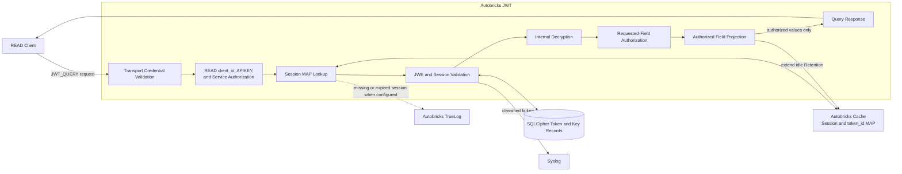
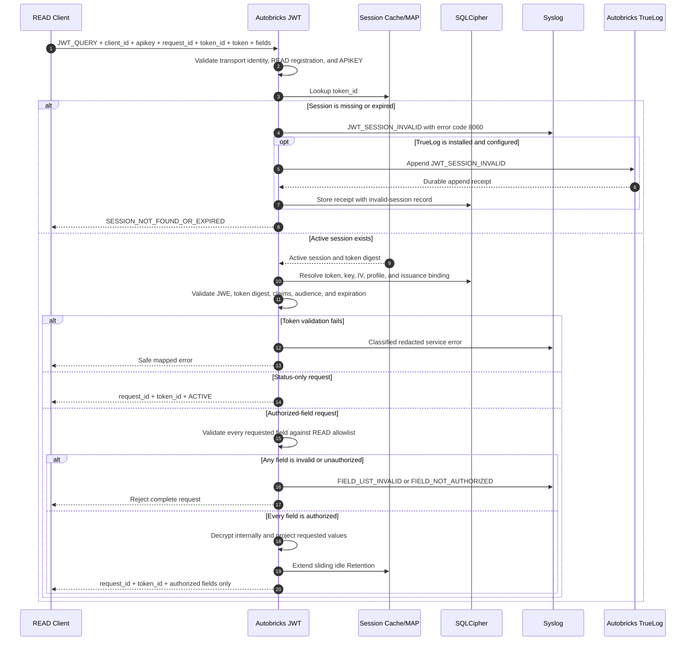
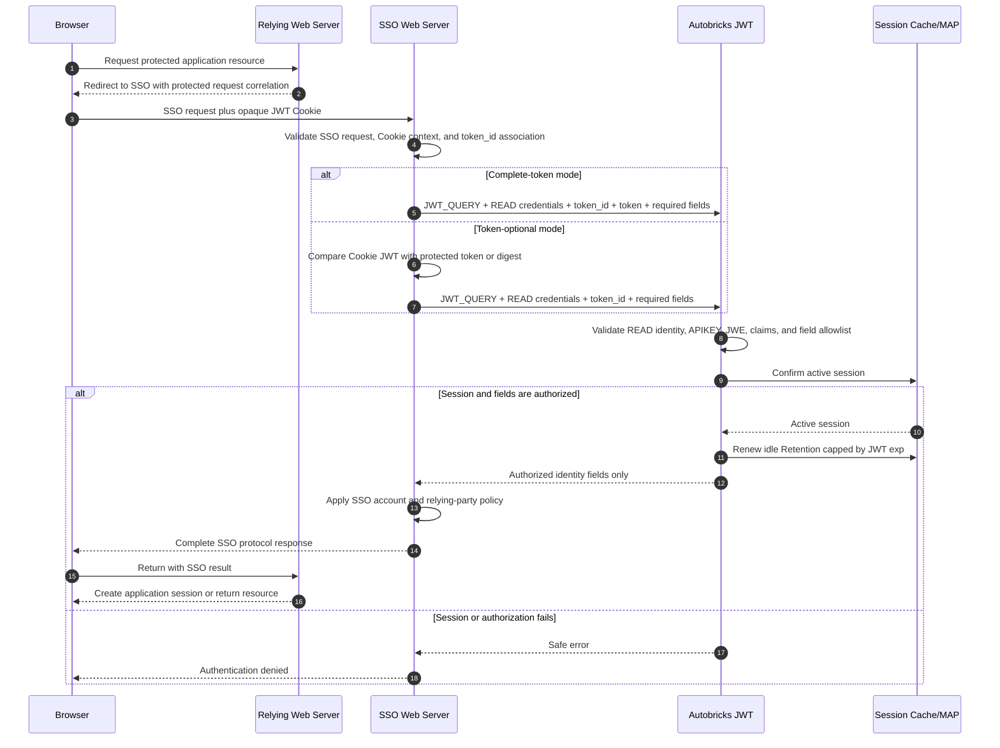
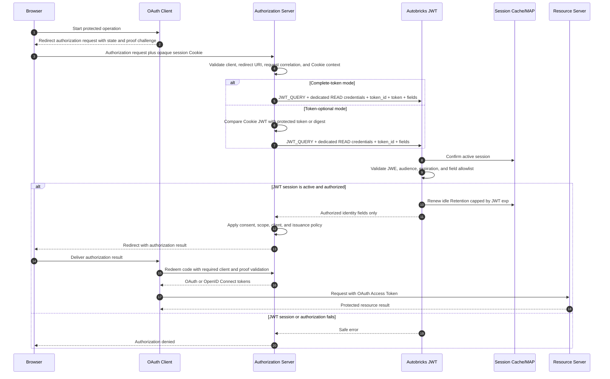

# Service JSON Web Token Query

## Purpose

JWT query is a runtime READ operation that checks an existing session or
returns explicitly authorized fields from its encrypted JWT. The caller
supplies the complete opaque token but never decrypts it. Autobricks JWT
validates and decrypts the complete token internally, then returns only the
requested fields permitted by the caller's READ service registration.

The query interface never returns the complete plaintext payload, a token key,
an IV, an unrequested field, or a field outside the registered allowlist.

## Preconditions

A query requires all of the following:

- The connection satisfies the registered UNIX, TCP, TLS, or mTLS credential.
- The `client_id` exists, is active, and has READ permission.
- The service registration exists, is active, and is bound to that `client_id`.
- The APIKEY is active and bound to the same service, `client_id`, and READ
  operation class.
- The subject type of the token matches the READ service registration.
- The one-to-one `token_id` is supplied. The complete encrypted `token` is also
  supplied when `require_token_for_query_and_revoke` is enabled.
- Every requested field is present in the READ service registration's field
  allowlist.
- The active session exists in the Autobricks Cache Session MAP.
- The SQLCipher token and key records required for validation are available.

A WRITE `client_id` or WRITE APIKEY cannot execute `JWT_QUERY`.

## Request Authentication

Authentication and authorization are evaluated as an intersection:

1. Authenticate the connection using its registered transport credential.
2. Resolve the active client registration from `client_id`.
3. Confirm that the authenticated connection identity belongs to that client.
4. Authenticate the APIKEY and confirm that it belongs to the same service and
   `client_id`.
5. Require READ permission across the connection identity, client
   registration, APIKEY, and `JWT_QUERY` operation.
6. Apply the field allowlist stored in that READ service registration.

For mTLS, connection authentication includes certificate-chain, validity,
client-authentication-purpose, AIA OCSP `GOOD` status, registered fingerprint,
and READ URI SAN validation. A certificate, `client_id`, or APIKEY that passes
one check cannot bypass any other check.

## Request Forms

Every request includes `operation`, `client_id`, `apikey`, a client-generated
`request_id`, and `token_id`. The complete encrypted `token` is conditionally
required by the server installation setting. The service and READ permissions
are resolved from the registered credentials and cannot be overridden by the
request.

With `require_token_for_query_and_revoke: true`, the request must contain the
complete JWE shown below. This is the secure default and proves that the caller
submitted the exact token bound to `token_id`.

### Active-Session Status

Omitting `fields` requests only an active-session status check:

```json
{
  "operation": "JWT_QUERY",
  "client_id": "<read-client-id>",
  "apikey": "<read-apikey>",
  "request_id": "<client-request-id>",
  "token_id": "<token-uuid>",
  "token": "<base64url-jwe-compact-token>"
}
```

An active status response contains no decrypted JWT field:

```json
{
  "request_id": "<client-request-id>",
  "token_id": "<token-uuid>",
  "status": "ACTIVE"
}
```

With `require_token_for_query_and_revoke: false`, the caller may omit `token`
to reduce network traffic:

```json
{
  "operation": "JWT_QUERY",
  "client_id": "<read-client-id>",
  "apikey": "<read-apikey>",
  "request_id": "<client-request-id>",
  "token_id": "<token-uuid>"
}
```

In token-optional mode, Autobricks JWT resolves the stored JWE through
`token_id` and performs the same internal cryptographic and session validation.
If the caller supplies `token`, it must match the stored token and is never
ignored.

### Authorized-Field Query

Supplying `fields` requests a projection of the listed fields:

```json
{
  "operation": "JWT_QUERY",
  "client_id": "<read-client-id>",
  "apikey": "<read-apikey>",
  "request_id": "<client-request-id>",
  "token_id": "<token-uuid>",
  "token": "<base64url-jwe-compact-token>",
  "fields": ["user_id", "role"]
}
```

`fields` must be a nonempty list of unique field names within the configured
request limits. Wildcards, paths to the payload root, JWT-controlled metadata,
and complete-object requests are not supported. Every name must appear in the
READ service registration's allowlist.

Authorization is all-or-nothing. If one requested field is invalid or not
authorized, the complete request is rejected. Autobricks JWT does not silently
omit that field or return a partial result.

A successful response contains only the requested authorized values:

```json
{
  "request_id": "<client-request-id>",
  "token_id": "<token-uuid>",
  "fields": {
    "user_id": "user-1001",
    "role": "member"
  }
}
```

## Validation and Processing

Autobricks JWT processes a query in this order:

1. Validate the frame, `JWT_QUERY` operation, required fields, `request_id`,
   and request limits.
2. Authenticate the connection credential, active READ `client_id`, service
   binding, and matching READ APIKEY.
3. Validate `token_id` as a UUID and locate the active session through the
   Session Cache `token_id` MAP.
4. When `token` is supplied, compare its digest with the digest bound to that
   session. When it is omitted in token-optional mode, select the stored token
   bound to the session.
5. Resolve the selected token, token-specific key, IV, encryption profile, and
   issuance relationship from the internal Cache and SQLCipher records.
6. Validate the JWE Compact structure, protected header, `kid`, algorithms,
   key size, stored IV, authentication tag, and ciphertext integrity.
7. Decrypt and parse the complete payload only inside `ab-jwtd`.
8. Validate `iss`, `sub`, `aud`, `iat`, `nbf`, `exp`, `jti`, `subject_type`,
   token/service bindings, and active session state.
9. For a status request, return only `ACTIVE` without returning a claim.
10. For a field query, validate the complete requested field list against the
    READ service allowlist, project only those values, and extend the active
    session's sliding Cache Retention.
11. Return the response without exposing the complete decrypted payload.

`token_id` accelerates lookup and selects the stored token in token-optional
mode, but it never replaces internal validation of that complete encrypted
token. A valid submitted token without its matching `token_id`, or a valid
`token_id` accompanied by a different token, is rejected.

An authorized field query extends only idle Retention. It does not change the
JWT `exp` value or its absolute expiration. A status-only check does not return
fields and does not extend idle Retention.

### Automatic Session Expiration Extension

Every successful authorized-field query automatically renews the effective JWT
session expiration using the Session Retention interval configured for that
service. The caller does not send a separate extension request.

Conceptually, `ab-jwtd` calculates the renewed idle deadline as:

```text
idle_expires_at = min(query_time + configured_session_retention, jwt_exp)
```

Each later successful authorized-field query repeats this calculation from its
own processing time. This provides sliding session expiration while the JWT is
actively used for authorized lookups. The renewed deadline can never exceed the
absolute expiration recorded by the JWT `exp` claim.

The extension changes the active Cache session deadline, not the encrypted JWT
string. It therefore does not require a replacement token. If Retention cannot
be renewed, the query fails with `8066 SESSION_RETENTION_FAILED` and does not
return field values while claiming that the session was extended.

## Query Block Diagram



The decryption and complete payload remain inside the JWT Service boundary.
Only the projected authorized values cross that boundary.

## Query Sequence Diagram



The sequence depicts the secure default in which the complete token is
submitted. In token-optional mode, the request omits `token` and the SQLCipher
lookup supplies the stored JWE to the same validation path.

## Web Server Responsibility

The Web Server is responsible for deciding whether its incoming application
request is entitled to use the JWT session. It obtains the opaque JWT from the
requesting client, binds it to the Web Server's own login, cookie, device, or
request context, and prevents one application user from querying another
user's session.

Autobricks JWT verifies token cryptography, registered service bindings,
session state, and field authorization. It cannot determine whether the Web
Server correctly authenticated the end user or correctly associated that user
with `token_id`. The Web Server must complete that check before calling
`JWT_QUERY`.

This responsibility does not permit the Web Server to decrypt the JWT or obtain
its key. The token remains opaque to the Web Server. In token-optional mode,
the responsibility is especially important because `ab-jwtd` receives no JWE
from which to confirm possession; it acts on the stored token selected by the
authorized request's `token_id`.

### Browser Cookie Integrity Example

A browser can receive the opaque JWT in a Cookie and later return that Cookie
to the Web Server. The browser is an untrusted holder and may alter the Cookie
value before submitting it.

When the Web Server forwards both `token_id` and the complete Cookie JWT,
`ab-jwtd` compares the submitted token with the stored token and validates its
JWE authentication tag, key, IV, claims, and session binding. A changed Cookie
cannot pass that validation.

When the Web Server omits the complete JWT, `ab-jwtd` loads the valid stored
token using `token_id`. It cannot see the Cookie value presented by the browser
and therefore cannot determine whether that value was changed. Before sending
a token-optional request, the Web Server must compare the browser's opaque JWT
with the exact token or a protected collision-resistant token digest retained
from issuance. A mismatch is rejected by the Web Server without calling
`JWT_QUERY`.

The Web Server performs an equality or digest check only. It does not decrypt
the JWT or interpret its claims.

### Token Submission Security Levels

| Mode | Browser JWT integrity check | Security effect |
| --- | --- | --- |
| Complete-token mode | `ab-jwtd` validates the exact JWE submitted through the Web Server. | Keeps cryptographic token validation inside Autobricks JWT and proves that the request carried the issued token. This is the secure default. |
| Token-optional mode with Web Server comparison | The Web Server compares the browser JWT with its protected issued-token value or digest before sending `token_id`. | Reduces JWT Service network traffic, but transfers browser-token integrity verification to the Web Server and adds its storage and comparison path to the trusted boundary. |
| Token omitted without Web Server comparison | No component validates that the browser presented the issued JWT. | Not an acceptable security configuration. A modified or substituted Cookie can be combined with a valid `token_id` without detection. |

Token-optional mode is valid only when the Web Server implements and protects
this comparison procedure. Installation of that mode does not automatically
provide the Web Server-side check.

## Security Deployment Levels

### Isolated Purpose-Specific Deployment

The strongest deployment separates each query purpose into its own Web Server,
service process, container, host, or equivalent security domain. Each domain
receives only its own READ connection credential, `client_id`, APIKEY, source
CIDR authorization, and minimum field allowlist.

The primary purpose of this separation is breach containment: compromise of
one application component or source-code path must not give the attacker every
JWT field-query permission. The attacker remains limited to the fields and
sessions authorized for the compromised domain. Credentials for another
purpose are not present in that domain and therefore cannot be recovered from
the same process memory, configuration, filesystem, or deployment secret.

For example, an authentication component can receive an APIKEY limited to
`user_id` and `status`, while an authorization component uses a separately
registered identity and APIKEY limited to `user_id`, `role`, and `permissions`.
Compromise of either component does not automatically disclose the other
component's credential or field scope.

### Shared Web Server Deployment

One Web Server may hold multiple READ registrations and APIKEYs when its
functional design requires several query purposes in one place. Separate field
allowlists still provide useful least-privilege checks, prevent an incorrect
code path from requesting arbitrary fields, and make authorization and
operational diagnosis more explicit.

This arrangement does not create an independent breach boundary when the
credentials share the same process, account, configuration, secret store, or
host. A compromise of that shared security domain can expose all APIKEYs held
there. Using multiple APIKEYs in one Web Server therefore forgoes the
containment benefit of purpose-specific deployment even though the logical
field permissions remain separate.

Deployment may choose this lower isolation level for operational or functional
reasons. It must not describe APIKEY separation inside one compromised security
domain as protection equivalent to separately deployed Web Servers.

Token-optional mode is a separate security tradeoff. It reduces network cost
but removes proof that the caller submitted the issued JWE, making protection
of `token_id` visibility and the complete READ authorization chain more
important. It does not expand the registered field allowlist.

## SSO Session Validation

An SSO service can use Autobricks JWT as the authoritative validator for its
browser login session. The SSO service remains responsible for its redirect,
relying-party, browser, and application-session rules. Autobricks JWT validates
only the registered JWT session and returns the authorized identity fields
required by the SSO decision.

The browser receives the opaque encrypted JWT as a protected Cookie. A relying
Web Server redirects an unauthenticated browser to the SSO Web Server. Only the
SSO Web Server holds the READ connection credential, `client_id`, and APIKEY;
neither the browser nor the relying Web Server receives those secrets.

An SSO validation follows this process:

1. The relying Web Server creates a protected SSO request containing its return
   location and a correlation value, then redirects the browser to the SSO Web
   Server.
2. The browser sends the SSO Cookie only to the authorized SSO origin.
3. The SSO Web Server validates the incoming SSO request, Cookie attributes,
   request correlation, and its local relationship between the Cookie and
   `token_id`.
4. In complete-token mode, it sends both `token_id` and the Cookie JWT to
   `JWT_QUERY`. In token-optional mode, it first compares the Cookie JWT with
   its protected issued-token value or digest and then sends `token_id`.
5. The SSO Web Server requests only the registered fields needed for the login
   decision, such as `user_id`, `status`, or `authentication_level` when those
   fields exist in the service allowlist.
6. Autobricks JWT validates the READ identity, APIKEY, session, selected JWE,
   audience, expiration, and requested fields.
7. A successful authorized-field query returns only the requested values and
   automatically renews idle Session Retention without extending JWT `exp`.
8. The SSO Web Server applies its own account, authentication-level, and
   relying-party rules before completing its SSO protocol response.
9. Any missing, expired, invalid, unavailable, or unauthorized result fails
   closed and does not create an authenticated SSO session.

### SSO Sequence



### Increasing SSO Security

- Run the SSO validation component in a security domain separate from ordinary
  application Web Servers.
- Register a dedicated READ certificate, `client_id`, APIKEY, source CIDR, and
  minimum field allowlist for SSO validation.
- Prefer complete-token mode when the SSO Web Server does not maintain a
  protected issued-token value or digest for exact Cookie comparison.
- Set the Cookie attributes appropriate to the deployment, including `Secure`,
  `HttpOnly`, a restrictive domain and path, and the required `SameSite`
  behavior. Never place the JWT in a URL.
- Protect the SSO request and response against substitution, replay, open
  redirect, login CSRF, and correlation mismatch within the SSO protocol.
- Do not share the SSO READ APIKEY with relying Web Servers or browser code.
- Use a separately protected WRITE component for global logout and
  `JWT_REVOKE`; the broadly used SSO READ component must not receive WRITE
  permission.
- Fail closed when Autobricks JWT, its Session Cache, certificate validation,
  OCSP validation, or the required field query is unavailable.

## OAuth and OpenID Connect Session Validation

An OAuth Authorization Server can use Autobricks JWT to validate the browser's
login session before it grants an authorization result. When identity claims
are returned to a client, the surrounding protocol is OpenID Connect. The
Authorization Server remains responsible for OAuth and OpenID Connect protocol
processing; Autobricks JWT does not issue authorization codes, OAuth Access
Tokens, Refresh Tokens, or ID Tokens.

The Autobricks encrypted session JWT and an OAuth token are different
credentials with different audiences and lifecycles. The Autobricks JWT must
not be exposed as an OAuth Bearer Token, and an OAuth Resource Server must not
receive the JWT Service APIKEY merely to process an Access Token.

An authorization flow uses Autobricks JWT as follows:

1. The OAuth Client creates an authorization request using its required state
   and proof values and sends the browser to the Authorization Server.
2. The browser sends its Authorization Server session Cookie containing the
   opaque Autobricks JWT.
3. The Authorization Server validates the OAuth client, redirect URI, request
   correlation, consent requirements, and its local Cookie-to-`token_id`
   relationship.
4. It uses complete-token or correctly implemented token-optional
   `JWT_QUERY` processing exactly as defined for Web Servers.
5. It requests only the identity and session fields needed for the authorization
   decision. The query cannot request OAuth scopes as undeclared JWT fields or
   bypass the registered field allowlist.
6. Autobricks JWT validates the session and returns only authorized fields. A
   successful field query renews idle Retention up to the JWT `exp` limit.
7. The Authorization Server applies its own OAuth client, user, consent, scope,
   redirect, and token-issuance policy.
8. Only after those checks succeed does the Authorization Server continue with
   authorization-code or token issuance under its OAuth or OpenID Connect
   rules.
9. Resource Servers validate the resulting OAuth Access Token under the OAuth
   deployment's own validation or introspection contract. They do not treat
   the Autobricks session JWT as that Access Token.

### OAuth Authorization Sequence



### Increasing OAuth and OpenID Connect Security

- Isolate the Authorization Server from OAuth Clients and Resource Servers. It
  alone receives the JWT READ credential used for browser-session validation.
- Create a dedicated READ registration and minimum field allowlist for each
  materially different authorization purpose. Separate deployments provide
  stronger containment than several APIKEYs stored in one process.
- Use the complete-token mode by default. Use token-optional mode only when the
  Authorization Server performs the protected Cookie token or digest comparison
  before every `JWT_QUERY`.
- Apply the OAuth deployment's exact redirect URI, state, proof-key, client
  authentication, consent, scope, replay, and token-lifetime requirements. JWT
  session validation does not replace those controls.
- Keep JWT Service credentials, OAuth client secrets, authorization codes,
  Access Tokens, Refresh Tokens, ID Tokens, and browser Cookies out of URLs,
  syslog, TrueLog, diagnostics, and error responses.
- Fail closed when JWT session validation is unavailable or returns any error.
  Do not issue an authorization code or OAuth token from a cached assumption
  that the user session remains active.
- Treat Autobricks session revocation and OAuth token revocation as separate
  state changes. A deployment that requires coordinated logout must explicitly
  revoke or terminate both lifecycles through their respective authorized
  components.

## State Changes

A successful status-only query does not change the JWT, its absolute
expiration, its field values, or its session idle Retention.

A successful authorized-field query:

- Automatically sets the active Cache session's idle expiration to the
  configured Session Retention interval from the current query time, capped by
  the JWT `exp` absolute expiration.
- Does not modify the encrypted JWT or issue a replacement token.
- Does not change the JWT `exp` value or absolute lifetime.
- Does not change the READ field allowlist.
- Does not create a TrueLog audit event or receipt.

A rejected query does not extend Retention. A missing or expired session is not
restored from SQLCipher history.

## Logging and Audit

Successful status checks and authorized-field queries do not create JWT
TrueLog events. Returned values, requested values, the token, APIKEY, decrypted
payload, key, and IV are never written to syslog or TrueLog.

Every classified failure writes its assigned `error_code` and `error_name` to
the operating server's syslog using redacted context. Syslog is operational
diagnostic output and is not audit evidence.

An expired or nonexistent session produces the common
`JWT_SESSION_INVALID` event with error code `8060`. The response and event never
distinguish expiration from nonexistence. When TrueLog is installed and
configured, the event is appended there and its validated receipt is stored in
the corresponding local invalid-session record. Without TrueLog, the event is
written only to syslog and no receipt is created.

## Errors

The query path uses the assigned errors from [ERROR.md](../ERROR.md), including:

| Code | Name | Query use |
| ---: | --- | --- |
| 8001 | `INVALID_REQUEST` | Required request data is missing or inconsistent |
| 8004 | `REQUEST_TOO_LARGE` | The request or requested field list exceeds its configured limit |
| 8006 | `REQUEST_TIMEOUT` | Query processing exceeds its deadline |
| 8030 | `APIKEY_AUTHENTICATION_FAILED` | APIKEY is missing, invalid, revoked, or incorrectly bound |
| 8031 | `APIKEY_OPERATION_FORBIDDEN` | APIKEY does not allow READ queries |
| 8032 | `OPERATION_CLASS_MISMATCH` | Credential, client, and APIKEY operation classes disagree |
| 8040 | `SERVICE_NOT_REGISTERED` | No matching active READ service registration exists |
| 8041 | `SERVICE_REGISTRATION_INACTIVE` | The matching service registration is inactive |
| 8043 | `FIELD_QUERY_FORBIDDEN` | The registered service cannot perform the requested field query |
| 8060 | `SESSION_NOT_FOUND_OR_EXPIRED` | The session is missing or no longer active |
| 8061 | `JWT_INVALID` | The token is malformed, mismatched, or fails integrity validation |
| 8062 | `JWT_AUDIENCE_INVALID` | The token is not valid for the authenticated service |
| 8063 | `FIELD_LIST_INVALID` | The field list is malformed, empty, duplicated, or too large |
| 8064 | `FIELD_NOT_AUTHORIZED` | At least one requested field is outside the allowlist |
| 8065 | `FIELD_VALUE_UNAVAILABLE` | An authorized requested value cannot be returned |
| 8066 | `SESSION_RETENTION_FAILED` | Sliding idle Retention could not be extended |
| 8082 | `CACHE_UNAVAILABLE` | The required Session Cache is unavailable |
| 8084 | `KEY_STORE_UNAVAILABLE` | The protected token-key store is unavailable |

Internal errors are mapped to the safe response defined by `ERROR.md`. Every
classified failure retains its root code in the redacted syslog entry.

## Security Boundaries

- The complete plaintext payload exists only inside Autobricks JWT.
- The caller receives only requested fields authorized for its READ service.
- READ permission cannot create, modify, or revoke a JWT session.
- No single request value authorizes a query. All registered identity and
  authorization bindings must agree; token possession is additionally required
  when the installation enables `require_token_for_query_and_revoke`.
- A field allowlist is an authorization boundary, not a substitute for
  separating credentials across independently protected Web Servers.
- Query processing never executes a subject Database SELECT or accepts SQL.
- Successful field access can extend idle Retention but never absolute token
  expiration.
- The privileged complete-token inspection path is separate, local,
  root-authorized, and unavailable through `JWT_QUERY`.
