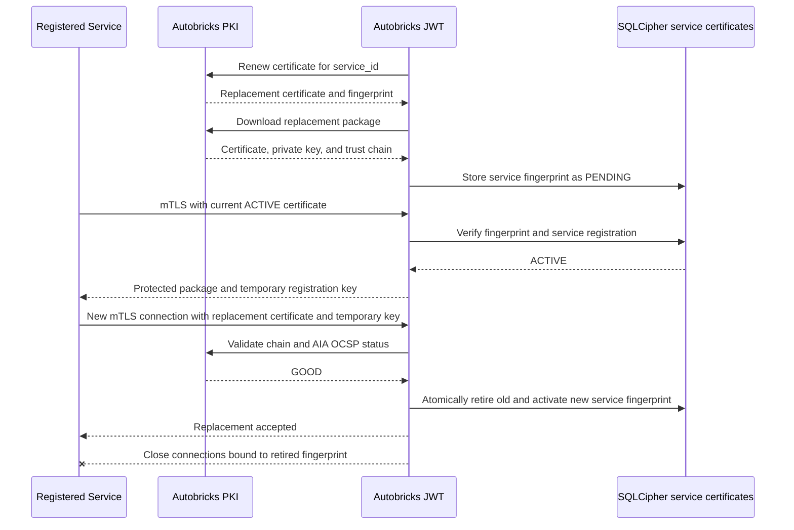

# Certificate Renewal

## Scope

Defines renewal ownership for the Autobricks JWT server certificate and issued
client certificates, the daily server renewal check, replacement validation,
listener restart behavior, and client fingerprint registration after renewal.

Certificate renewal uses the installed and configured Autobricks PKI client.
Deployments without that dependency do not expose TLS or mutual TLS and do not
run the certificate-renewal scheduler.

## Renewal Responsibility

| Certificate | Renewal owner | Required result |
| --- | --- | --- |
| Autobricks JWT server certificate | `ab-jwtd` server scheduler | Install a verified replacement and restart the TLS and mutual TLS listeners |
| Issued service certificate | `ab-jwtd` certificate scheduler | Renew one service-bound certificate, deliver its replacement package, and complete the protected fingerprint handover |

Autobricks JWT keeps PKI renewal credentials in its protected service boundary.
The registered service receives only its issued certificate package and never
receives another service's certificate or PKI renewal credential.

## Daily Server Renewal Check

The server certificate renewal scheduler runs once per day. Installation
records one local server time in 24-hour `HH:MM` format. The default is
`04:00`; an administrator can select a different time during installation.

At the configured time, the scheduler executes the equivalent of:

```text
abpki-cli renew <current-server-certificate-fingerprint>
```

The scheduler uses the fingerprint of the certificate currently installed by
Autobricks JWT. A successful check that does not issue a replacement leaves the
runtime certificate and every listener unchanged.

## Server Certificate Replacement

When `abpki-cli renew` returns a replacement certificate and its new
fingerprint, the server performs these steps:

1. Download the replacement package with `abpki-cli download` into a protected
   staging location.
2. Confirm that the package contains `certificate.pem`, `private-key.pem`, and
   `trust-chain`.
3. Verify the returned fingerprint, certificate and private-key match, trust
   chain, server-authentication purpose, validity interval, required server
   identity, Subject Alternative Names, and AIA OCSP information.
4. Replace the active certificate, private key, trust chain, and configured
   current fingerprint as one protected update.
5. Restart the TLS and mutual TLS listeners.
6. Verify that new secure connections present the replacement certificate.

The listener restart occurs only after all replacement material validates and
the protected installation succeeds. A failure before activation preserves the
currently installed certificate and leaves the existing listeners in service
while that certificate remains valid. Renewal and listener-restart failures
write classified, redacted service errors to the operating server's syslog.
Private keys, renewal credentials, download credentials, and certificate
contents are never written to logs.

Unix domain socket and plain TCP listeners do not use the server certificate
and are not restarted by certificate replacement.

## Service Certificate Renewal

Autobricks JWT renews each service certificate through the same installed PKI
client identity that performed its initial issuance. Renewal is scoped to one
`service_id`; other services sharing the same `client_id` are not changed.
After PKI issues a replacement, Autobricks JWT downloads and validates the new
certificate, private key, and trust chain and stages the package for protected
delivery to that service.

A renewed service certificate has a new SHA-256 fingerprint. Autobricks JWT
authorizes mutual TLS only when the presented fingerprint matches an active
SQLCipher `service_certificates` record. Certificate replacement therefore
uses a restricted mutual TLS handover protocol. It is not a JWT operation and
does not grant client registration, service registration, APIKEY management,
or other local management privileges.

The replacement certificate must retain the single URI SAN required by the
registered operation class:

| Operation class | Required URI SAN |
| --- | --- |
| `READ` | `urn:autobricks:jwt:read` |
| `WRITE` | `urn:autobricks:jwt:write` |

Autobricks JWT validates the replacement certificate's trust chain, validity,
client-authentication purpose, AIA OCSP status, registered fingerprint, and URI
SAN on a new mutual TLS connection. A PKI-issued replacement that has not
completed the handover remains unauthorized for JWT operations.

## Service Fingerprint Handover Procedure

The service keeps its current certificate and private key available until the
complete handover succeeds. It must not overwrite or remove the current
runtime certificate before the replacement is activated.

The handover proceeds as follows:

1. Autobricks JWT renews the certificate associated with the exact
   `service_id` through `abpki-cli`.
2. Autobricks JWT downloads and verifies the replacement package, including
   the certificate/private-key match, fingerprint, service identity, exact
   READ or WRITE URI SAN, trust chain, validity, and AIA OCSP `GOOD` status.
3. Autobricks JWT stores the replacement fingerprint as `PENDING` for that
   service and creates a single-use temporary certificate registration key.
4. The service connects to Autobricks JWT with its currently registered
   certificate. Autobricks JWT performs the normal chain, validity, OCSP,
   fingerprint, URI SAN, source CIDR, `service_id`, `client_id`, and APIKEY
   checks.
5. Over that authenticated connection, Autobricks JWT delivers the protected
   replacement package and its single-use temporary registration key to the
   exact service. The current fingerprint remains `ACTIVE`.
6. The service installs the replacement package without discarding the current
   package, then opens a separate mutual TLS connection using the replacement
   certificate and submits the same `client_id`, APIKEY, `request_id`, and
   temporary certificate registration key.
7. The replacement connection is accepted only for handover proof while its
   fingerprint is `PENDING`. It cannot execute JWT creation, update, revocation,
   or query operations.
8. Autobricks JWT verifies the replacement certificate chain, validity,
   client-authentication purpose, AIA OCSP `GOOD` status, fingerprint, client
   identity, exact URI SAN, source CIDR, temporary certificate registration
   key, APIKEY, `service_id`, and association with the original active
   registration.
   Successful mutual TLS also proves possession of the replacement
   certificate's private key.
9. In one SQLCipher transaction, Autobricks JWT promotes the replacement
   fingerprint to `ACTIVE` and retires the previous fingerprint. There is never
   more than one active fingerprint for the service registration.
10. Autobricks JWT closes keep-alive connections bound to the retired
    fingerprint and returns handover success over the replacement connection.
11. The service activates the replacement certificate as its runtime identity
    and removes the retired private key according to its protected credential
    disposal policy.



## Temporary Certificate Registration Key

The temporary certificate registration key is cryptographically random and is
not an APIKEY. It authorizes only proof and activation of the single pending
replacement certificate for which it was issued. It is bound to the
`request_id`, `client_id`, `service_id`, operation class, current fingerprint,
and pending replacement fingerprint.

Autobricks JWT returns the plaintext key only over the mutually authenticated
connection that uses the current `ACTIVE` certificate. SQLCipher stores only a
protected verifier for the key. The plaintext key is never written to the
Database, Cache, configuration, syslog, TrueLog, command-line arguments, or
certificate metadata.

The key expires after the configured handover timeout and is consumed exactly
once by a successful fingerprint transition. It cannot create another pending
fingerprint, authenticate a normal connection, or authorize any JWT or
management operation.

A timeout, disconnect, invalid temporary key, validation failure, mismatched
identity, mismatched URI SAN, incorrect APIKEY, or failed SQLCipher transaction
deletes the `PENDING` fingerprint and leaves the current fingerprint `ACTIVE`.
Certificate contents and temporary-key material are never written to logs.

If the current certificate is expired, revoked, unavailable, or cannot
authenticate, remote handover is forbidden. An authorized administrator must
replace the fingerprint through the local `ab-jwt-cli` management path after
performing the same replacement-certificate validation. This recovery path
does not weaken the normal requirement to prove possession of the active
certificate during an automated handover.

Existing keep-alive connections never extend beyond the certificate validity
and connection-lifetime limits defined by the service. Certificate renewal does
not bypass connection authentication, OCSP validation, APIKEY validation, or
the READ and WRITE permission boundary.
