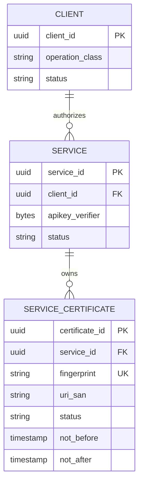
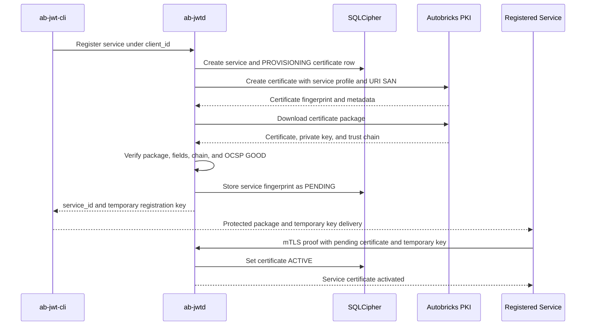

# Service Certificate

## Purpose

Defines how Autobricks JWT uses Autobricks PKI to assign an independent mutual
TLS identity to each registered service. The certificate limits the effect of
one service credential being compromised without changing the READ or WRITE
permission represented by its parent `client_id`.

Autobricks PKI is a general certificate authority. It validates supported
certificate fields and issues the requested certificate, but it does not
interpret `client_id`, `service_id`, JWT permissions, APIKEYs, or the
application meaning of a URI SAN. Autobricks JWT owns those meanings and
enforces all relationships described in this document.

## Identity Relationships

`client_id` identifies a reusable READ or WRITE permission group. It is not a
certificate identity. A client can contain multiple independently registered
services:

```text
client_id 1 ---- N service_id
service_id 1 ---- 1 ACTIVE service certificate
```

During certificate replacement, one additional `PENDING` certificate can exist
for the same service. Only one fingerprint can be `ACTIVE` at a time.



For example, three services can share one WRITE `client_id` while retaining
three separate network identities:

```text
WRITE client_id
├── token-issuance service   -> APIKEY A -> fingerprint A
├── token-update service     -> APIKEY B -> fingerprint B
└── token-revocation service -> APIKEY C -> fingerprint C
```

Compromise or revocation of fingerprint A does not authorize or disable the
other two services.

## Availability

Service certificates are available only when the Autobricks PKI client is
installed, configured, reachable, and the JWT server has enabled mutual TLS.
Without that integration, a service can use only the credential and transport
combinations permitted by the active dependency profile. TLS supplies server
authentication and encryption but does not create a service certificate
identity.

## SQLCipher Records

The `clients` table stores the permission group and does not store a service
certificate fingerprint. The service relationship is divided between the
following logical records.

### `services`

| Field | Requirement | Meaning |
| --- | --- | --- |
| `service_id` | Required | Unique service registration identifier |
| `client_id` | Required | Parent READ or WRITE permission group |
| `service_name` | Required | Operator-visible service name |
| `apikey_verifier` | Required | Protected verifier for this service's APIKEY |
| `status` | Required | Service registration state |
| `created_at` | Required | UTC creation time |
| `updated_at` | Required | UTC last modification time |

### `service_certificates`

| Field | Requirement | Meaning |
| --- | --- | --- |
| `certificate_id` | Required | Internal UUID for the certificate record |
| `service_id` | Required | Service that exclusively owns this certificate |
| `fingerprint` | Required | Lowercase SHA-256 fingerprint of the complete DER certificate |
| `uri_san` | Required | Exact READ or WRITE JWT operation URI |
| `common_name` | Required | Certificate subject identity returned by PKI |
| `serial_number` | Required | Issuer-assigned certificate serial number |
| `not_before` | Required | Certificate validity start time |
| `not_after` | Required | Certificate validity end time |
| `status` | Required | `PROVISIONING`, `PENDING`, `ACTIVE`, `RETIRED`, or `FAILED` |
| `created_at` | Required | UTC record creation time |
| `activated_at` | Conditional | UTC activation time |
| `retired_at` | Conditional | UTC retirement time |

The fingerprint is globally unique. A service has at most one `ACTIVE` row and
at most one `PENDING` row. A certificate row cannot be reassigned to another
service or client. Certificate private keys, certificate packages, PKI access
tokens, APIKEY plaintext, and temporary registration-key plaintext are not
stored in these tables.

## Operation URI SAN

Autobricks JWT derives the required URI SAN from the parent client's operation
class. The operator cannot substitute another value during certificate
provisioning.

| Parent operation class | Required URI SAN | Permitted JWT operations |
| --- | --- | --- |
| `READ` | `urn:autobricks:jwt:read` | Session check and authorized-field query |
| `WRITE` | `urn:autobricks:jwt:write` | JWT creation, update, and revocation |

Autobricks PKI encodes the supplied fields. Autobricks JWT is responsible for
checking that the returned certificate contains the required JWT operation URI
and no conflicting JWT operation URI.

## Certificate Profile

Service registration can supply the certificate profile fields supported by
the installed Autobricks PKI version. Autobricks JWT forwards validated fields
without assigning PKI-wide meaning to them. The following values are mandatory
for JWT service authentication and cannot be weakened by optional profile
input:

| Field | JWT requirement |
| --- | --- |
| Certificate type or EKU | Must support client authentication |
| Common Name | Must be unique for this service-certificate lineage |
| URI SAN | Must contain the single READ or WRITE JWT operation URI derived from the parent client |
| Validity | Must be within the issuer validity and accepted JWT service bounds |
| AIA OCSP | Must be present in the issued certificate and usable for status validation |

Subject DN attributes, supported SAN types, key usage, certificate policies,
and other PKI-supported fields can be included in the service profile. They do
not grant JWT permission. Autobricks JWT interprets only its defined JWT URI
SAN and rejects missing, duplicate, conflicting, or unknown
`urn:autobricks:jwt:*` values.

The initial certificate uses a unique Common Name associated with
`certificate_id`. Renewal preserves the certificate lineage defined by PKI;
Autobricks JWT maps every replacement fingerprint back to the same
`service_id`.

## Initial Certificate Provisioning

Certificate provisioning begins only after a `service_id` has been allocated
and the service registration has passed validation. The procedure is:

1. Load the active parent `client_id` and its READ or WRITE operation class.
2. Confirm that mutual TLS is enabled for the client and available on the JWT
   server.
3. Create the service record and one `PROVISIONING` certificate record inside
   SQLCipher before contacting PKI.
4. Construct a unique certificate subject for this `service_id`, a client-auth
   profile, and the exact operation URI SAN derived from the parent client.
5. Invoke `abpki-cli create` through the installed PKI client.
6. Capture the returned certificate fingerprint and certificate metadata. PKI
   field acceptance does not constitute JWT authorization.
7. Invoke `abpki-cli download` and obtain the certificate, private key, and
   trust chain in a protected staging area.
8. Verify the package members, certificate/private-key match, fingerprint,
   trust chain, client-authentication purpose, validity interval, URI SAN, and
   AIA OCSP URL.
9. Query the AIA OCSP responder and require a current, signed `GOOD` result.
10. Persist the verified fingerprint and metadata as `PENDING`, bound only to
    this `service_id`.
11. Generate a single-use temporary certificate registration key and bind it
    to the service, client, APIKEY scope, pending fingerprint, request, and
    expiration time.
12. Deliver the protected certificate package to the registering operator or
    service through the approved certificate-delivery path.
13. Activate the fingerprint only after the service proves possession of the
    delivered private key through mutual TLS and presents the temporary key.



The PKI issuance call is not repeated automatically after an ambiguous lost
response. The existing `PROVISIONING` record and unique certificate subject
prevent a retry from silently creating another service certificate.

## Temporary Certificate Registration Key

The temporary key is a cryptographically random, single-use secret. It is not
an APIKEY and cannot authorize a JWT operation or a general management
operation. SQLCipher stores only its protected verifier.

The key is bound to all of the following values:

- `client_id`
- `service_id`
- Certificate fingerprint
- READ or WRITE operation class
- Service-registration `request_id`
- Expiration time

Activation requires the key and a successful mutual TLS handshake using the
pending certificate. This proves possession of the corresponding private key.
A mismatched, expired, or previously consumed key rejects activation without
changing the service's active certificate state.

## Service-Registration Result

The successful result separates the service credential from its certificate
state:

```json
{
  "service_id": "<service-uuid>",
  "client_id": "<client-uuid>",
  "operation_class": "WRITE",
  "apikey": "<service-apikey>",
  "certificate": {
    "certificate_id": "<certificate-uuid>",
    "fingerprint": "<sha256-fingerprint>",
    "uri_san": "urn:autobricks:jwt:write",
    "status": "PENDING",
    "not_after": "<rfc3339-time>"
  },
  "temporary_certificate_registration_key": "<single-use-secret>"
}
```

The certificate package is binary secret material and is never embedded in
this JSON response. The APIKEY and temporary registration key are displayed
only through their approved one-time credential-delivery paths.

## Runtime Authentication

For mutual TLS, request authorization follows this sequence:

1. Validate the certificate chain, validity interval, client-authentication
   purpose, AIA OCSP response, and source CIDR.
2. Resolve the presented fingerprint to one `ACTIVE`
   `service_certificates` row.
3. Resolve that row to its active `service_id` and parent `client_id`.
4. Verify that the request's `service_id`, `client_id`, and APIKEY all resolve
   to the same service relationship.
5. Verify that the certificate URI SAN, parent operation class, APIKEY scope,
   and requested JWT operation agree.

Effective authorization is the intersection of:

```text
ACTIVE certificate fingerprint
AND certificate service_id
AND APIKEY service_id
AND requested client_id
AND parent client operation class
AND certificate URI SAN
AND source CIDR
AND current OCSP GOOD status
```

Knowledge of `client_id` is not authentication. A valid certificate belonging
to another service under the same client is rejected, even when both services
have the same operation class.

## Renewal and Replacement

Renewal is performed for one service certificate at a time. A replacement is
stored as `PENDING` beside the service's current `ACTIVE` certificate. The
temporary registration key binds both fingerprints and the exact `service_id`.
After the replacement certificate proves private-key possession, one SQLCipher
transaction changes the new row to `ACTIVE` and the old row to `RETIRED`.
Other services under the same `client_id` are unaffected. The complete
handover procedure is defined in
[Certificate Renewal](15-certificate-renewal.md).

## Revocation, Service Deletion, and Client Deletion

- Revoking or retiring one service certificate affects only that service.
- Deleting a service disables its APIKEY, retires its active and pending
  certificate bindings, closes its authenticated connections, and removes its
  service Cache entries.
- Deleting a client applies the service-deletion behavior to every service
  under that client.
- Certificate issuance history and retained operational or audit evidence are
  not erased by deleting an active binding.

PKI certificate revocation and removal of a JWT certificate binding are
separate actions. A certificate must satisfy both PKI validity and the active
JWT service binding to authenticate.

## Failure and Atomicity Rules

- PKI, download, package, certificate, OCSP, persistence, or delivery failure
  never produces an `ACTIVE` fingerprint.
- A failed initial activation leaves the service unable to perform mutual TLS
  JWT operations.
- A failed renewal leaves the previous certificate `ACTIVE` while it remains
  valid and `GOOD`.
- An `ACTIVE` fingerprint is never reassigned to another service.
- APIKEY authorization begins only after certificate authentication succeeds.
- Cache entries can accelerate fingerprint lookup but SQLCipher remains the
  authoritative certificate-binding store.
- Restart and recovery rebuild certificate-binding Cache entries only from
  valid SQLCipher state.

## Logging and Secret Handling

Certificate lifecycle failures write classified, redacted service errors to
the operating server's syslog. Logs can contain `request_id`, `client_id`,
`service_id`, certificate state, and an assigned error code. They never contain
an APIKEY, temporary registration key, PKI access token, private key,
certificate package, or complete certificate contents.

Certificate issuance by Autobricks PKI and JWT service binding are separate
security events. A PKI-issued certificate that is absent from an `ACTIVE`
service binding remains unauthorized by Autobricks JWT.

## Errors

| Code | Name | Use |
| ---: | --- | --- |
| 8010–8018 | Certificate and OCSP validation errors | Reject an absent, untrusted, invalid, expired, revoked, unknown, or unverifiable certificate before service authorization |
| 8019 | `CERTIFICATE_NOT_REGISTERED` | Reject a fingerprint without an active service binding during normal JWT access |
| 8021 | `CERTIFICATE_USAGE_INVALID` | Reject a missing, duplicated, conflicting, or unknown operation URI SAN |
| 8022 | `CERTIFICATE_USAGE_MISMATCH` | Reject a URI SAN that differs from the parent client operation class |
| 8027 | `CERTIFICATE_REGISTRATION_KEY_INVALID` | Reject an invalid temporary certificate registration key |
| 8028 | `SERVICE_CERTIFICATE_BINDING_MISMATCH` | Reject a fingerprint, service, client, APIKEY, or URI SAN binding mismatch |
| 8029 | `CERTIFICATE_HANDOVER_FAILED` | Record a failed atomic pending-to-active transition and preserve the previous active certificate |
| 8044 | `SERVICE_CERTIFICATE_PROVISIONING_FAILED` | Record PKI issuance, download, package verification, or initial persistence failure and expose only its documented generic mapping |

The complete exposure and syslog contract remains authoritative in
[ERROR.md](../ERROR.md).
